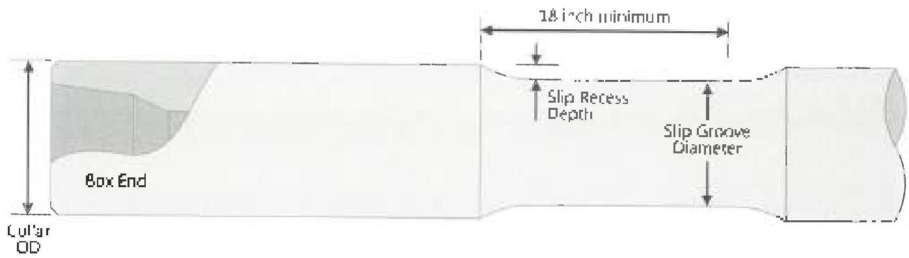

f. Cracks: Any crack shall be cause for rejection. The repair of rotary shouldered connections with cracks shall be conducted as per section 3.31.

g. Indications: Parts with questionable indications shall be reclaimed and reinspected. A repeatable indication shall be cause for rejection. Grinding or buffing of indications is prohibited.

h. After inspection, penetrant and developer shall be removed with water or solvent spray. With fluorescent penetrant, a blacklight shall be used to check for complete removal.

i. Thread Compound and Protectors: All acceptable connections shall be coated with an acceptable tool joint compound over all thread and shoulder surfaces, including the end of the pin. Thread protectors shall be applied and secured using 50 to 100 ft-lb of torque. The thread protectors shall be free of any debris.

## 3.18 Slip Groove Inspection

### 3.18.1 Scope

This procedure covers the dimensional verification of the drill collar OD and slip groove press depth and length. Customer requirements shall prevail in all cases pertaining to final acceptance/rejection of slip grooves not meeting this procedure.

Note. In previous editions of Standard DS-1 elevator grooves were also considered in this procedure. Due to safety and compatibility concerns, API no longer supports the manufacture or use of traditional square-shouldered drill collar elevator grooves, and the DS-1 sponsor group agrees with this change.

As such, there is no longer a DS-1 dimensional inspection for the drill collar elevator groove.

It is recognized that these products may still be in circulation, and this is acceptable as long as the groove is not used for lifting purposes. The crack-detection for all grooves, slip and elevator, in this procedure is still required.

### 3.18.2 Inspection Apparatus

A 12-inch metal rule graduated in 1/64 inch increments, a metal straightedge, and OD calipers are required.

### 3.18.3 Preparation

The groove areas shall be clean so that bare metal is visible over the entire groove surface.

### 3.18.4 Procedure and Acceptance Criteria

a. Dimensions shall be as shown in Figure 3.18.1.

b. Slip Groove Diameter: The slip groove diameter shall be measured approximately in the middle of the recess using OD calipers. Two diameter measurements shall be taken, approximately 90 degrees apart. The diameter shall meet the requirements below, where the diameter is calculated as:

$$
\text{Nominal Collar OD} - 2 \times \text{Slip Recess} = \text{Slip Recess Diameter} \times \frac{1}{16} \text{ inch} + Q
$$

|  Collar OD (inch) | Slip Recess Depth (inch, -1/32, 0)  |
| --- | --- |
|  4 - 4-5/8 | 5/32  |
|  4-3/4 - 5 5/8 | 5/32  |
|  5-3/4 6-5/8 | 7/32  |
|  6-3/4 - 8-5/8 | 7/32  |
|  > 8-3/4 | 7/32  |

Figure 3.18.1 Drill roller slip grooves.