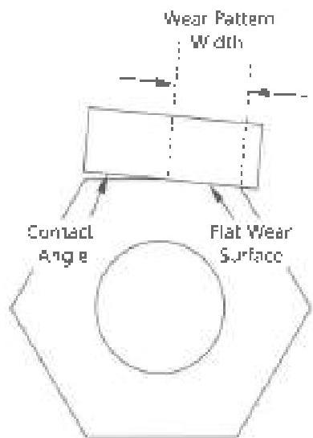

Figure 3.20.1 Kelly wear pattern and contact angle

Maximum Contact Angle for Kelly Drive Sections

|  Kelly Size (inch) | Square Kelly (degrees) | Hexagonal Kelly (degrees)  |
| --- | --- | --- |
|  2-1/2 | 17 | -  |
|  3 | 16 | 12  |
|  3 1/2 | 15 | 11  |
|  4-1/4 | 14 | 10  |
|  5-1/4 | 13 | 9  |
|  6 | - | 8  |

## 3.20.12 Magnetic Particle Body Inspection

Inspect the outside surface of the tool from shoulder to shoulder in accordance with procedure 3.9, Magnetic Particle Inspection of Slip/Upset Areas. Any crack is cause for rejection.

## 3.20.13 Post Inspection Requirements

Clean and dry the connections and thread protectors. Apply thread compound and apply thread protectors. Place a 2 inch wide white paint band around an acceptable tool. The paint band should be 12 inches ±2 inches from the box end. Using a permanent paint marker on the outer surface of the tool, write or stencil the words "DS-1 Kelly Inspection," the date, and the name of the company performing the inspection.

## 3.21 Connection Phosphating

### 3.21.1 Scope

This procedure covers the process control requirements for phosphating newly-machined or recut rotary-shouldered connections using zinc phosphate or manganese phosphate methods. This procedure is not required for connections that have only been refaced. Any required thread gauging must be completed prior to phosphating to ensure accurate measurements.

### 3.21.2 Apparatus

#### 3.21.2.1 Phosphating Procedure Specification

A detailed, written procedure for treating the connections, using the specific phosphating product and equipment in place, must be available at the job site. This procedure, at a minimum, shall contain requirements for:

a. Solution Control: All variables about the phosphating solution that must be controlled and measured in order to ensure high-quality results. The specification shall, at a minimum, list acceptable ranges, measurement methods, and measurement intervals for the following:

- Solution and Bath Temperature
- Acid Concentration
- Other key variables which require monitoring and control as stated by the manufacturer

b. Connection Preparation: The steps required to ensure the connection surfaces have been correctly prepared for phosphating, and any control methods used to ensure that the preparation has been satisfactorily completed. This preparation may be mechanical (e.g. bead blasting), chemical (e.g. detergent solutions), or both.

c. Phosphating Procedural Steps: Step-by-step instructions for treating the connections. The specification shall, at a minimum, include steps for:

- Pre-rinsing (if necessary)
- Exposure times
- Nozzle arrangement and pressure (if spraying)
- Post treatment rinsing and passivation
- Limits for time between process stages
- Other key steps in the specified phosphating process

d. Acceptable and Rejectable Phosphating Results: A clear inspection procedure for evaluating the results of the phosphating treatment, including unambiguous details on acceptable and rejectable phosphate conditions.

e. System Quality Confirmation: Any periodic testing required to confirm that the phosphating system in place is giving acceptable, repeatable results. This