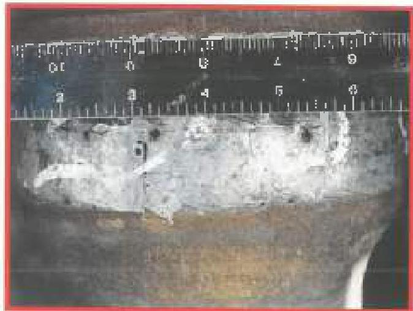
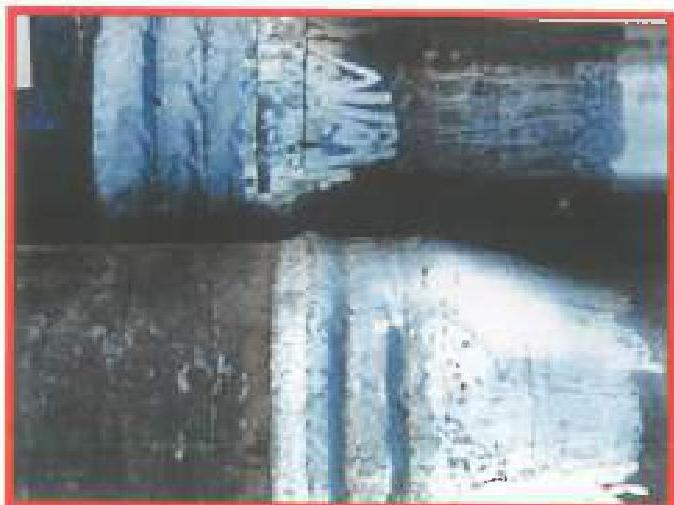
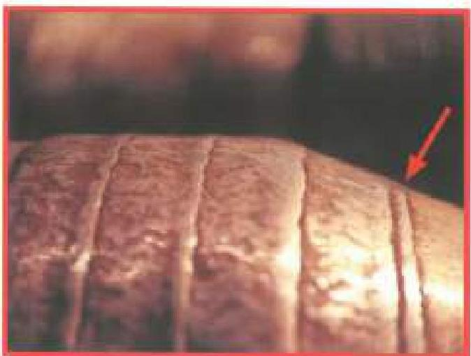

## 3.22.5 Post Welding Requirements

### 3.22.5.1 Weld Quality Inspection

The applied hardbanding shall be visually examined, checking the following:

a. Porosity, Voids, and Blowholes: Any voids or holes in the hardbanding greater than 1/16 inch in diameter are rejectable (see Figure 3.22.1). Chipping or flaking of the weld material is also cause for rejection.

b. Bead Profile: The weld bead profile shall be checked with a metal straightedge, and must be flat to slightly convex and consistent throughout the entire hardbanding. Concave profiles are cause for rejection. Weld bands that are significantly "bumped" in the center may be repaired by grinding if practical (see Figure 3.22.2).

c. Tie-In: The weld bands must tie in with the parent metal and other bands consistently with no deep voids. Grooves or voids at tie-in locations (hardbanding band to parent material and between hardbanding weld bands) must be less than 1/8 inch wide and 1/16 inch deep. Small areas of poor tie-in may be repaired by spot welding before the component is cool, but repair welds shall not continue more than 45 degrees around the circumference of the component (see Figure 3.22.3).

d. Crack Patterns: Crack patterns in the finished hardbanding shall be examined and compared to the acceptable crack patterns specified by the WPS. Any crack patterns rejected by the manufacturer's specification or not addressed by the specification are cause for rejection.

### 3.22.5.2 Weld Geometry

The weld application geometry must meet the customer's specifications. Typically, the hardbanding can be either flush with the component OD or proud by 3/32 inch (±1/32 inch), measured twice 90 degrees apart. Any hardbanding on the 18 degree box taper must be flush to avoid damaging elevators (see Figure 3.22.4). Other acceptable and unacceptable features for some typical hardbanding products are illustrated in Figures 3.22.5 through 3.22.15.

### 3.22.5.3 Blacklight Inspection

The hardbanded component and the nearest connection to the applied hardbanding (if present) shall be inspected using the Blacklight Connection Inspection method (procedure 3.15). Any cracks or crack-like indications in the non-hardbanded areas are cause for rejection.

Figure 3.22.1. Voids and holes &gt; 1/16" - Unacceptable. (Photo courtesy of Arco)

Figure 3.22.2. Weld bead profile "bumper" in middle of weld bead - Unacceptable. (Photo courtesy of Arco)

Figure 3.22.3. Improper tie-in on 18" shoulder, repaired with single weld - Unacceptable. (Photo courtesy of Arco)

103