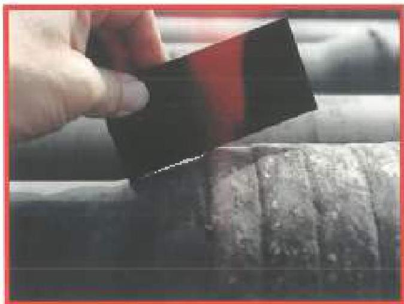
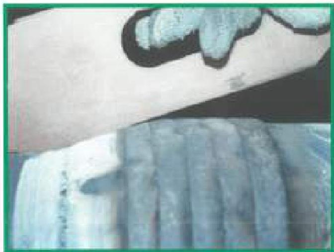
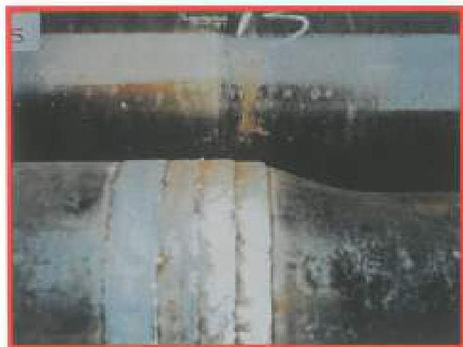
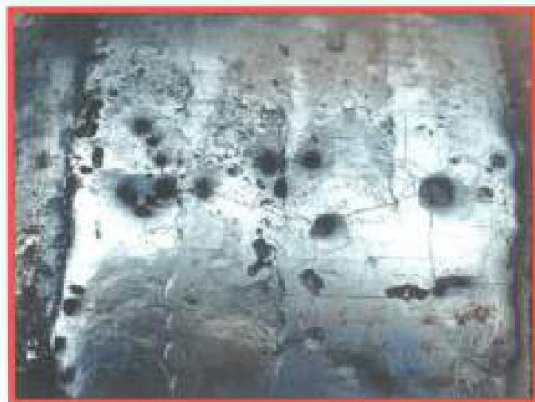
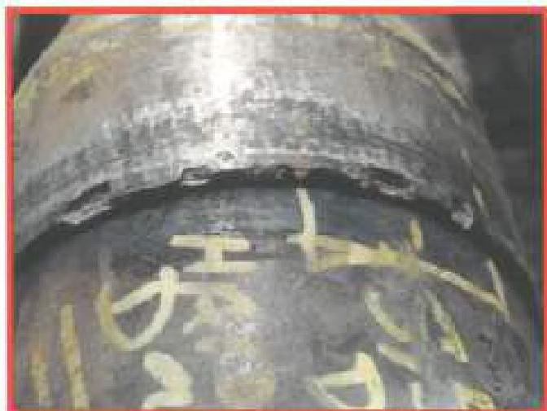
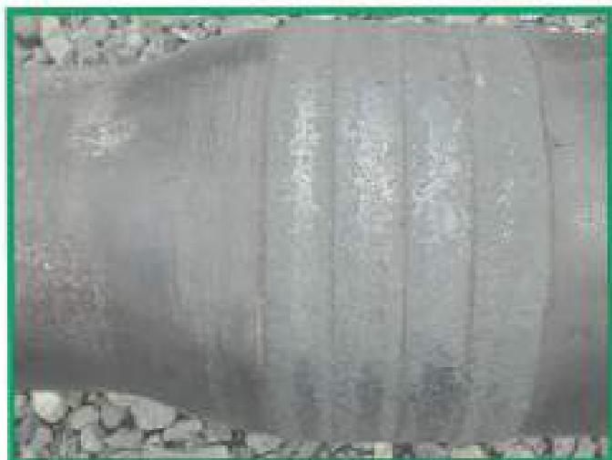

Figure 3.22.4 Weld bead profile step on 18" shoulder - Unacceptable. (Photo courtesy of Amco)

Figure 3.22.5 Weld profile at box tool joint taper - Acceptable. (Photo courtesy of Amco)

Figure 3.22.6 "Stair-stepped" weld bead profile and not flush on 18" shoulder - Unacceptable. (Photo courtesy of Amco)

Figure 3.22.7 Excessive porosity in worn layer - Unacceptable. (Photo courtesy of Amco)

Figure 3.22.8 Flaking or chipping - Unacceptable. (Photo courtesy of Amco)

Figure 3.22.9 Tuboscope 105 (Lanham on used pipe) - Acceptable. (Photo courtesy of Tuboscope)

104