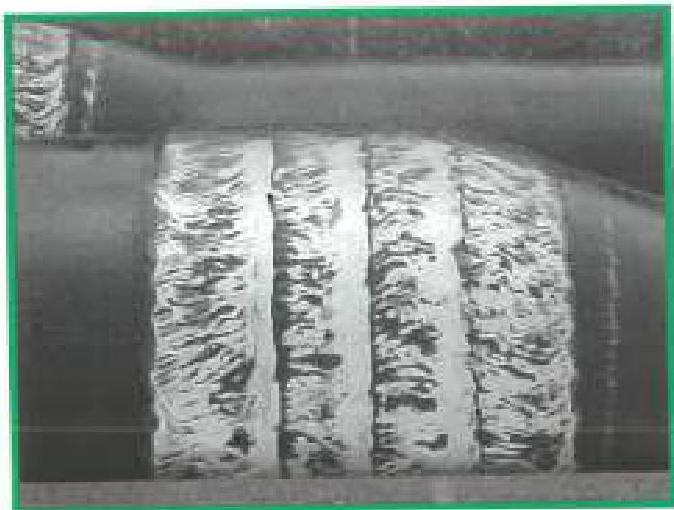
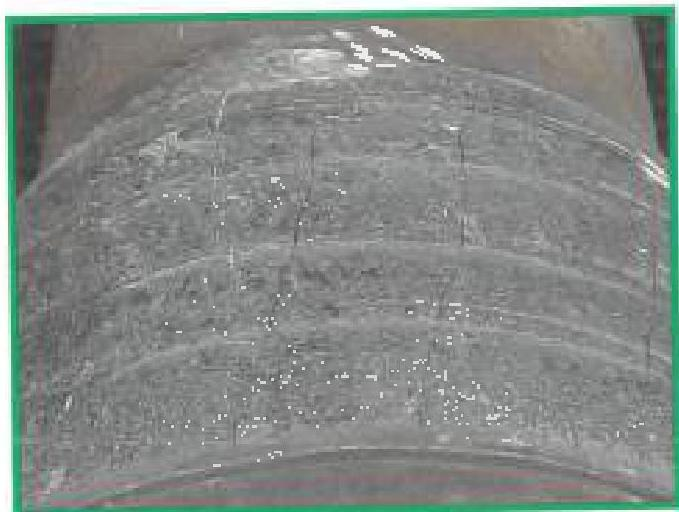
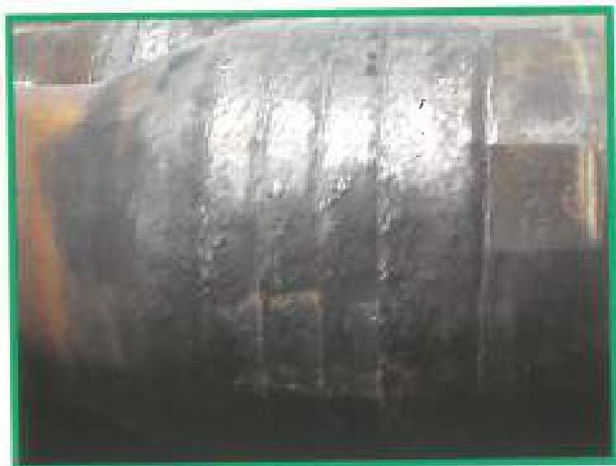
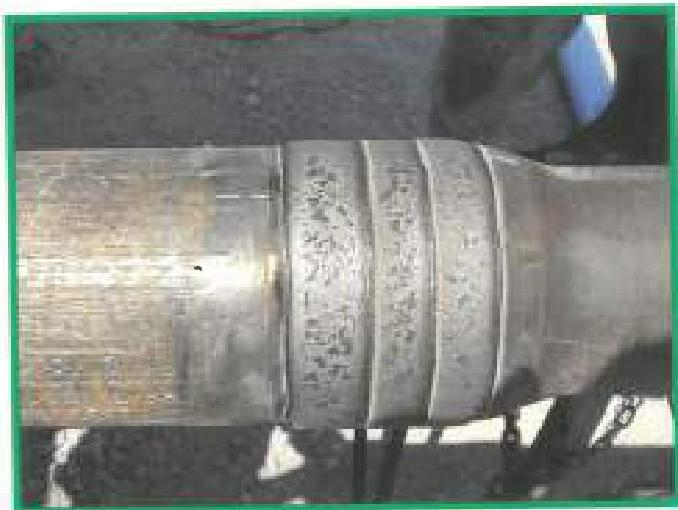
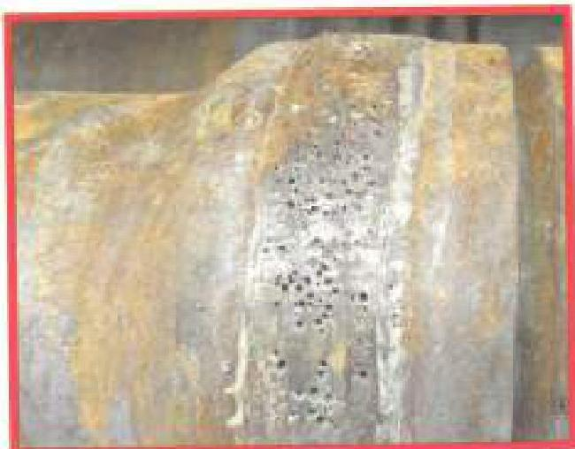
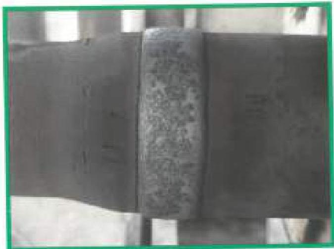

Figure 3.22.10 Tuboscope TCS 8000 (in used pipe) - Acceptable. (Photo courtesy of Tuboscope)

Figure 3.22.11 Tungsten Carbide Crack - Acceptable. (Photo courtesy of Tuboscope)

Figure 3.22.12 FinnChromix X-38 - Acceptable. (Photo courtesy of Pinnacle)

Figure 3.22.13 MStar on used pipe - Acceptable. (Photo courtesy of Liquidmetal Coatings)

Figure 3.22.14 MStar on used pipe with excessive porosity - Unacceptable. (Photo courtesy of Liquidmetal Coatings)

Figure 3.22.15 Hardbanding (350X) applied to a workstring tubing connection - Acceptable. (Photo courtesy of Amco)

105