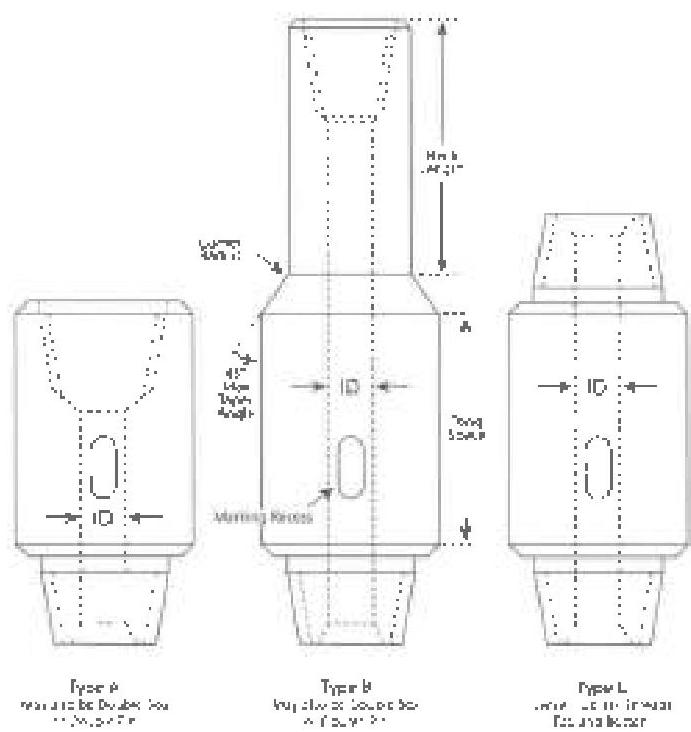

nine internal surface, a calibrated light meter to verify illumination, metal scale, tape measure, flat file or disk grinder. See section 2.21 for calibration requirements.

## 3.25.4 Stress Relief Features Required on BHA Subs

Bit subs and subs joining other BHA connections, with connections NC38 and larger, shall have pin stress relief grooves and boreback boxes or they shall be rejected. (Note: Special-purpose subs, like bit subs, do not require a boreback box when the box connection directly connects to the bit or the subs require inside diameters that do not accommodate a boreback box. When this occurs, specific dimensional acceptance criteria from the special sub-manufactures shall apply. Special-purpose subs, like bit subs, do not require a stress relief groove.)

## 3.25.5 Visual Connection Inspection

Inspect the connections in accordance with procedure 3.11, omitting sections 3.11.3a and 3.11.4a.

Note: For thread roots on bit subs, pitting is allowed on all threads as long as pitting does not occupy more than 1-1/2 inches in length along any thread helix or the pit depth does not exceed 1/32 inch or the pit diameter does not exceed 1/8 inch.

## 3.25.6 Dimensional Inspection

a. Inspect the connections of bit subs and subs that will join other BHA connections in accordance with

Figure 3.25.1 API drilling subs

procedure 3.14. Dimensional 3 Inspection, except that bevel diameter shall meet the requirements in steps b-d below, whichever applies, and the stress relief feature requirements shall be in accordance with paragraph 3.25.4, Box OD and pin ID measurements shall result in a BSR within the customer's specified range for bit subs and other sub connections that will join BHA components, except for connections made up to the bit or HWDP. Dimensions for commonly specified BSR ranges are given in Table 3.9. BSR values for various connection types and sizes are provided in Table 3.16.

b. Bit subs and other sub connections that will join BHA components, except HWDP: Use bevel diameter from Table 3.9.

c. Sub connections joining HWDP: Use bevel diameter from Table 3.10.1-3.10.10, as applicable.

d. For bit sub connections joining bits: Use the following bevel diameter ranges.

|  Connection | Bevel Diameter (m)  |   |
| --- | --- | --- |
|   |  Minimum | Maximum  |
|  2-3/8 Reg | 3-1/32 | 3-1/16  |
|  2-7/8 Reg | 3-19/32 | 3-5/8  |
|  3-1/2 Reg | 4-3/32 | 4-1/8  |
|  4-1/2 Reg | 5-5/16 | 5-11/32  |
|  6-5/8 Reg | 7-11/32 | 7-3/8  |
|  7-5/8 Reg | 8-29/64 | 8-31/64  |
|  8-5/8 Reg | 9-17/32 | 9-9/16  |

e. Inspect the connections of subs that will join drill pipe connections or lower kelly connections in accordance with procedure 3.13, Dimensional 2 Inspection.

f. Tong space: Minimum tong space shall be 7 inches.

g. Inside Diameter: Subs with the same connection top and bottom shall have straight bores with inside diameter (ID) not greater than the ID of the largest pin to which the sub will be joined. Subs with different connections top and bottom may be equipped with step bores. In these subs, the torsional capacity of the pin with the larger ID may not be less than the torsional capacity of the connection on the other end of the sub.

h. Length: Measure overall length shoulder to shoulder. Measure neck length on type B subs. Subs shall meet the length requirements below or shall be rejected.