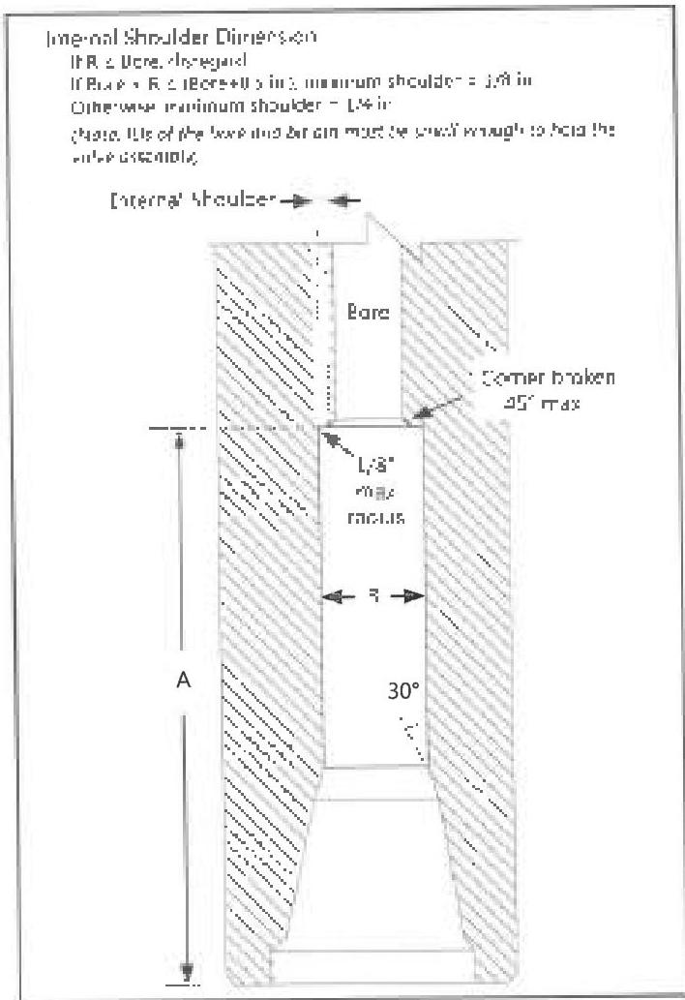
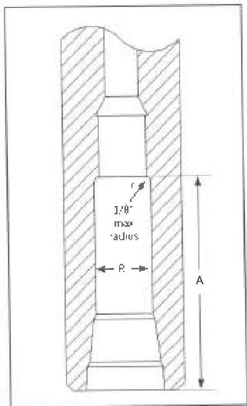

|  Type | Minimum Overall Length (in) | Minimum Neck Length (in)  |
| --- | --- | --- |
|  A (box × box) | 24 | -  |
|  A (pin × pin) | 12 | -  |
|  A (box × pin) | 16 | -  |
|  B | see below | 13.24.6c  |
|  C | 8 | -  |

For type B subs only: Minimum overall length requirement does not apply. The minimum fishing neck length is according to the requirements specified in paragraph 3.24.6c and the minimum tong space is 7 inches. The maximum OD taper angle shall not exceed 45 degrees.

Note: For box × pin Type B ads, the box side is considered the fishing side. For box × box, pin × pin, or subs run in the pin up configurations, the customer must specify the uphole connection to which the fishing neck applies.

Figure 3.25.2 Float bore profile.

1. Float bore dimensions: On subs equipped with float bores, the ID shall be free of flaws or pitting that will interfere with the valve's ability to seal. For box up float bores without stress relief features and for box down float bores, the float bore dimensions shall meet the dimensions given in Figure 3.25.2 and Table 3.12. If a baffle plate is to be used with the float valve, the bore shall be visually inspected for the presence of a baffle recess as seen in Figure 3.25.3. If a baffle plate is to be used with a baffle plate recess (Figure 3.25.3), the baffle recess should be of sufficient depth to include the baffle plate and the float bore dimensions shall meet the dimensions given in Figure 3.25.3 and Table 3.12. If a baffle plate is to be used without a baffle plate recess (Figure 3.25.2), the float bore dimensions shall meet the dimensions given in Figure 3.25.2 and the float bore depth shall not exceed the bore depth listed in Table 3.12 plus the height of the baffle plate.

Note: If the Float Bore Diameter (R) and Connection Size do not match Table 3.12 values, calculate the Float Bore Depth (A) using Table 3.12.1.

Figure 3.25.3 Float bore profile with baffle plate recess

111