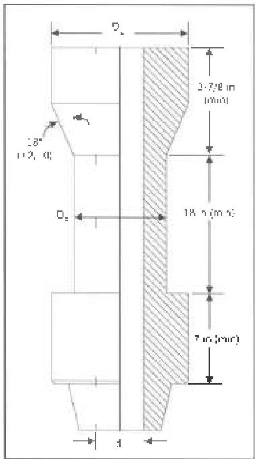

J. Lift sub dimensions: Lift subs for drilling equipment shall meet the dimensions shown in Figure 3.25.4 and the following (in inches):

|  D_{p} (±1/32) | D_{s} (±1/8, -0) | d (max)  |
| --- | --- | --- |
|  2 3/8 | 3-1/2 | 1-49/64  |
|  2-7/8 | 4-1/4 | 2 9/64  |
|  3-1/2 | 5 | 2-45/64  |
|  4 | 6 | 3-17/64  |
|  4-1/2 | 6-1/4 | 3-49/64  |
|  5 | 6-1/2 | 3-49/64  |
|  5-1/2 | 7 1/4 | 4-1/64  |
|  5-7/8 | 7-9/16 | 4-17/64  |
|  6 5/8 | 8 | 5-1/64  |

Note: The super angle is also allowed to be 90 degrees (a square-shouldered lift sub), but no other configurations are supported by this standard.

Other sizes of lift subs may be needed for specific operations, elevators, or pipe configurations. If the lift sub is to be rejected according to these requirements, the inspector should contact the end user to determine whether a waver is necessary based on the expected operating conditions.

## 3.25.7 Blacklight Connection Inspection

Inspect the end connections in accordance with procedure 3.15, Blacklight Connection Inspection. If the sub is nonmagnetic, substitute procedure 3.17. Liquid Penetrant Inspection, instead of Blacklight Connection Inspection.

## 3.25.8 Visual Body Inspection

a. Surface Condition: Visually examine the outside surface of the sub from shoulder to shoulder for mechanical damages. Any cut, gouge, or similar imperfection on the outside surface deeper than 10% of the adjacent wall shall be rejected. The outside and inside surfaces shall be clean so that the metal surface is visible and no surface particles larger than 1/8 inch in any dimension can be broken loose. Additionally, the inside diameter(s) of the sub shall be free of any obstruction or foreign objects.

b. Markings: The sub shall have a marking recess which shall show the manufacturer's name or mark, the words "SPEC 7-1," the upper and lower sub connections, and the inside diameter(s) of the sub. Information listed on the markings shall conform to the actual ID(s) and connections on the sub. (Subs which do not show these marks do not comply with API Specification 7-1.)

## 3.25.9 Magnetic Particle Body Inspection

Inspect the outside diameter from shoulder to shoulder in accordance with procedure 3.9, MPI Slip/Upper Inspection. Any crack shall be rejected. If the sub is manufactured from non-magnetic materials, procedure 3.17, Liquid Penetrant Inspection, shall be substituted for Magnetic Particle Inspection.

## 3.25.10 Post Inspection Requirements

Clean and dry the connections and thread protectors. Apply thread compound and apply thread protectors. Mark an acceptable tool in accordance with the marking requirements specified for BHA components in procedure 3.35.

## 3.26 Pup Joint Inspection 1

### 3.26.1 Scope

This procedure covers Visual Tube inspection, Visual Connection inspection, and Dimensional Inspection of integral and welded pup joints.

Figure 3.25.4 Lift sub dimensions.