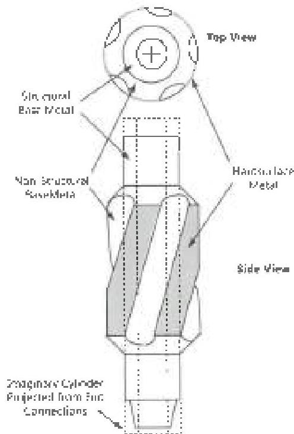
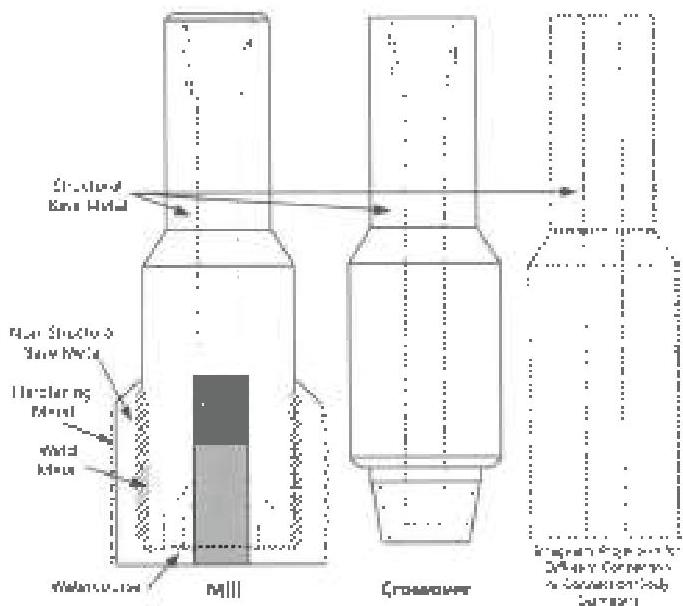
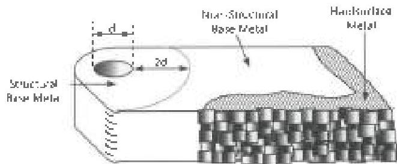

# 3.28.2.3 End Connections

Connections that join a fishing tool to the drill string component(s) immediately above and below the tool.

# 3.28.2.4 Metals

Metals in this procedure are classified according to their use in a particular fishing tool. Five different classifications are recognized.

a. Base Metal (Structural): A portion of the tool which, if it fails, could result in string separation or loss of all or a significant part of a pinned-on or bolted-on component. Structural base metal specifically encompasses all metal meeting the following tests:

- All metal located inside a projection of an imaginary cylinder encircling the end connection or connections (Figure 3.28.1). If two end connections on a tool have different outside diameters, or if the tool has only one end connection and a body outside diameter that is different from the end connection outside diameter, two imaginary cylinders shall be projected to establish structural base metal (Figure 3.28.2).
- Portions of a tool or component that lie within two hole diameters of a hole, excluding hardsurface metal (Figure 3.28.3).
- Any other metal which, in the opinion of the inspector, meets the general definition for structural base metal above.

b. Base Metal (Non-Structural): Metal whose failure will not result in string separation or loss of all or a significant part of a component. Non structural base metal specifically includes all metal meeting the following tests:

- A metallic component that is attached by welding to structural base metal (such as a blade or a welded-blade stabilizer or mill) but not including weld metal or hardsurface metal (Figure 3.28.2).
- Metal located outside a projection of a cylinder or cylinders encircling the end connection(s), unless such metal meets the requirements for structural base metal above (Figure 3.28.1).

c. Hardsurface Metal: Metal deposited on base metal by welding or brazing, and intended for the purpose of improving wear resistance or cutting ability of the fishing tool.

Figure 3.28.1 Metal classification on an example integral blade string mill.

Figure 3.28.2 Metal classification on example tools.

Figure 3.28.3 Metal classification on an example cutter blade.