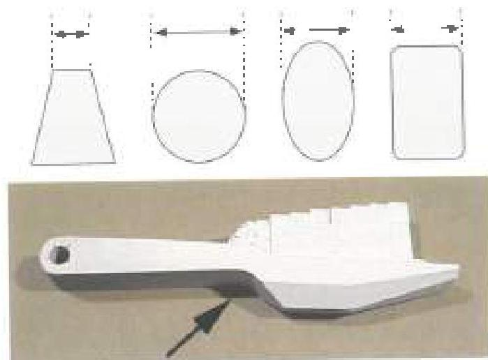
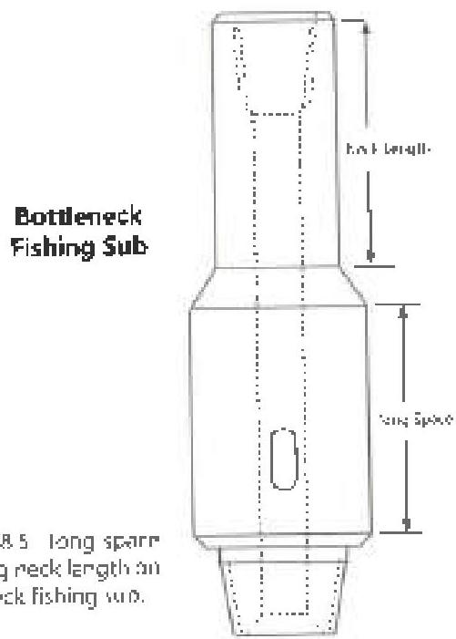

## 3.28.10 Visual/Dimensional Body Inspection

### 3.28.10.1 Cuts, Gouges, and Similar Flaws - Except on Wash Pipe

Refer to the manufacturer's shop/assembly manual to determine the manufacturer's recommended limits for cuts, gouges, and similar flaws. Examine the outside surfaces of the tool case, arms, cutters, and other components for mechanical damage. A cut, gouge, or similar flaw on structural base metal surfaces shall be cause for rejection of a component if the flaw:

a. Is deeper than 15% of the adjacent wall thickness for tubular components such as tool bodies.
b. Is deeper than 15% of the component thickness for solid components such as cutter arms. Thickness of a solid component is defined as the smallest distance between opposite surfaces, measured at the thinnest point (see Figure 3.28.4 for examples).
c. Is greater than 0.25 inch in depth for odd-shaped components.
d. Exceeds the limits given in the manufacturer's shop/assembly manual for the tool in question.

In cases where the flaw size exceeds the limits in a through c above, but does not exceed the specific limits allowed in the manufacturer's shop/assembly manual, or no flaw size limitation is listed in the manufacturer's shop/assembly manual, the manufacturer's engineering department may further evaluate and accept the flawed component, provided it does so in writing with reference to the specific flaw(s) in question. If the manufacturer's engineering department evaluates and accepts the flaw in writing, the tool shall be accepted, and the written acceptance shall become part of the inspection report to the customer. Otherwise, the part must be rejected.

### 3.28.10.2 Cuts, Gouges, and Similar Flaws on Wash Pipe

Body visual acceptance criteria for wash pipe is listed in Table 3.3.

### 3.28.10.3 Neck Length on Bottleneck Fishing Subs

Bottleneck crossover subs used exclusively for fishing shall have a minimum fishing neck length of 14 inches, measured from shoulder bevel to taper, and a minimum long space of 7 inches (see Figure 3.28.5). This requirement applies only to bottleneck crossover subs, since some fishing tools are designed with shorter fishing necks and long space.

Subs which will be used exclusively for rotary drilling shall meet the requirements of procedure 3.25, Sub Inspection.

### 3.28.10.4 Strap Welding

Tools that show evidence of having been strap welded shall be rejected unless this requirement is waived by the customer.

Thickness of Example Solid Components (In Cross Section)
Figure 3.28.4 Measuring the "thickness" of a solid component. Measure the smaller cross-section dimension at the point where it is thinnest.

Bottleneck Fishing Sub
Figure 3.28.5 Long space and fishing neck length on a bottleneck fishing sub.