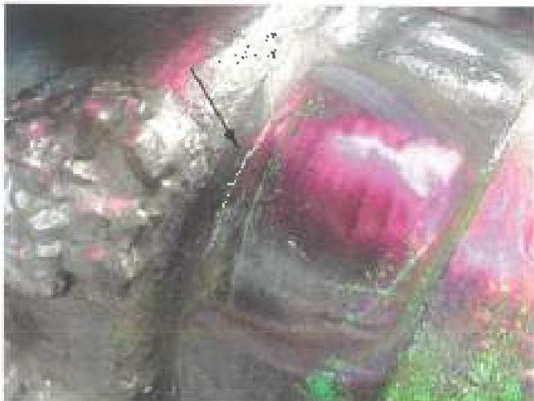
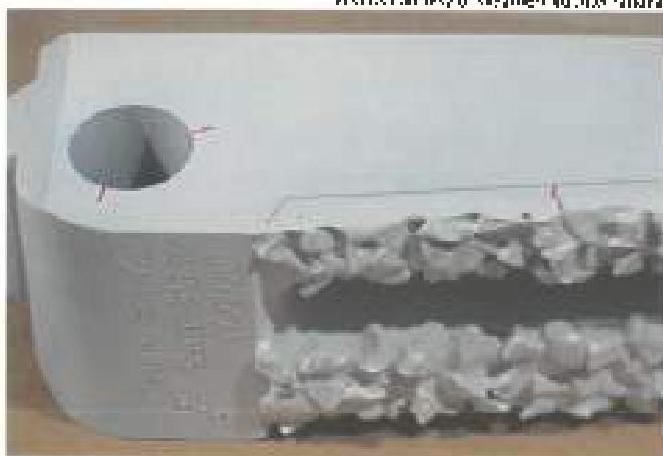
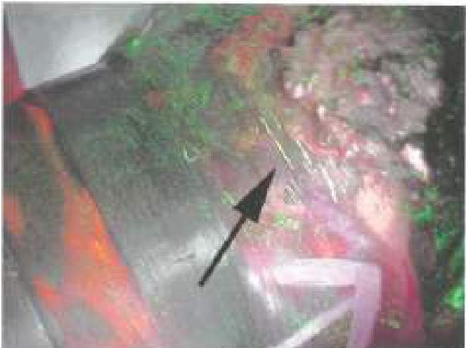
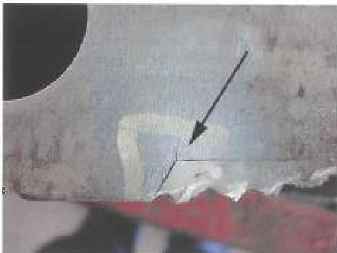
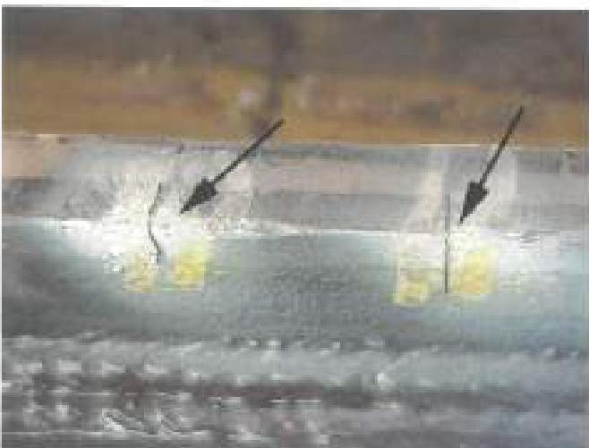
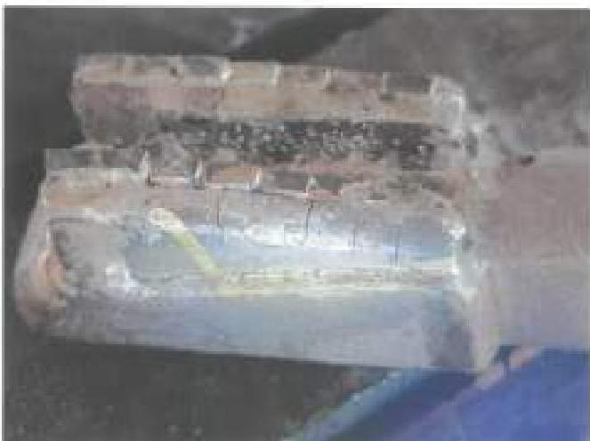

Figure 3.28.6 Rejectable cracks in structural base metal (arrow). The cracked surface lies within the imaginary cylinder formed by the connection ODs.

Figure 3.28.7 A cutter blade. Cracks in structural base metal near the pin hole (left) are rejectable. The acceptable crack at right is in non-structural base metal, originates in hardsurface metal and is less than 0.5 inch deep.

Figure 3.28.8 Cracks on this mill are rejectable. The crack is not in structural base metal, but it does not originate in hardsurface metal. Crack depth is unknown.

Figure 3.28.9 This crack on a cutter blade is rejectable because it is in structural base metal (within two hole diameters of the pin hole).

Figure 3.28.10 Rejectable cracks in non-structural base metal (arrows). The cracks are larger than permitted.

Figure 3.28.11 Acceptable cracks (less than 0.5 inch long) in non-structural base metal on a cutter knife

122