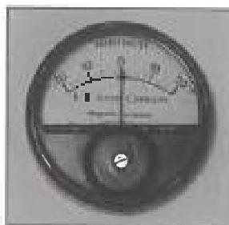

# 3.29 Residual Magnetic Particle Inspection Method

## 3.29.1 Scope and Purpose

This procedure is intended only for inspection of ferromagnetic surfaces on which an active field cannot practically be used. The purpose of this procedure is to detect transverse, longitudinal, and oblique flaws using either the wet fluorescent residual magnetic particle technique or the dry visible residual magnetic particle technique.

## 3.29.2 Inspection Apparatus

### 3.29.2.1 General Apparatus

a. A direct current (DC) source and conductor are required to magnetize the inspection surfaces.
b. Required magnetic particle field indicators (MPFI) include a pocket magnetometer (Figure 3.29.1) and either a magnetic flux indicator strip or a magnetic penetrometer (pie gauge).
c. A mirror is required for examination of concealed surfaces.
d. A calibrated light meter to verify illumination. See section 2.21 for calibration requirements.

### 3.29.2.2 Wet Fluorescent Method

The following apparatus is required if the wet fluorescent method is used.

a. An ASTM centrifuge tube with stand.
b. Particle bath medium and fluorescent particles

- Petroleum base mediums which exhibit natural fluorescence under blacklight shall not be used. Diesel fuel and gasoline are not acceptable.
- Water base mediums are acceptable if they were the surface without visible gaps. If incomplete coverage occurs, additional cleaning, a new particle bath, or the addition of more wetting agents may be necessary.

Figure 3.29.1 A pur set magnetometer.

c. A blacklight source and a calibrated blacklight intensity meter are required. See section 2.21 for calibration requirements.
d. A dark room, portable booth, or tarp shall be available to control the ambient light, if the inspection is performed during daylight hours.

### 3.29.2.3 Dry Visible Method

If the dry visible method is used, the dry magnetic particles shall be of contrasting color to the inspection surface and shall be free from rust, grease, paint, dirt, and/or other contaminants that may interfere with the particle characteristics.

## 3.29.3 Preparation

### 3.29.3.1 Cleaning

All surfaces to be inspected shall be clean to a degree that the metal surfaces are visible and free of contaminants (such as dirt, oil, grease, loose rust, sand, scale, and paint, that will restrict particle movement). Contaminants that are detectable by wiping with a dry, unused white paper towel or tissue on the surface shall be removed. For dry powder inspection, the surfaces shall also be dry to the touch.

### 3.29.3.2 Wet Fluorescent Method

If the wet magnetic particle method is used, verify particle concentration and blacklight intensity as follows:

a. Particle concentration test: Particle concentration shall range from 0.1 to $0.4\mathrm{ml} / 100\mathrm{ml}$ when measured using a $100\mathrm{ml}$ ASTM centrifuge tube, using a minimum settling time of 30 minutes in water based carriers or 1 hour in oil-based carriers. Repeat this test whenever the solution is diluted or particles are added. Agitate the solution thoroughly before each test.
b. Blacklight intensity test: Measure the blacklight intensity with an ultraviolet light meter. The minimum intensity shall be 1000 microwatts/cm² at fifteen inches from the light source or at the distance to be used for inspection, whichever is greater. Repeat this test each time the light is turned on, after every 8 hours of operation, and at the completion of the job.
c. The intensity of ambient visible light, measured at the inspection surface, shall not exceed 2 foot-candles.