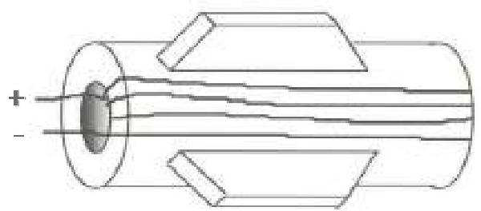
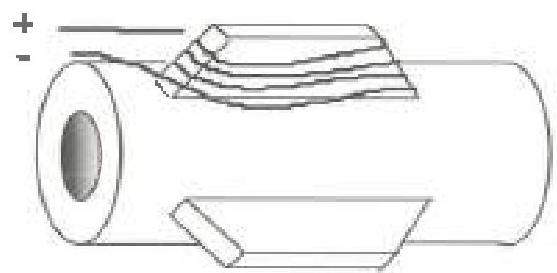
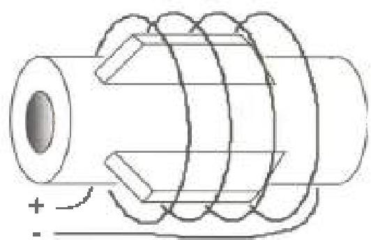

Figure 3.29.2 Some means of inducing magnetic fields. Circular field in a tool (top), transverse field in a protruding tool member (center), longitudinal field (bottom). Other means are acceptable so long as they leave an adequate residual field of the proper orientation

## 3.29.3.3 Dry Particle Inspection

The minimum illumination level at the inspection surface shall be 50 foot-candles. Visual acuity requirements shall be per section 2.20.2. Light intensity level at the inspection surface must be verified:

- At the start of each inspection job.
- When light fixtures change positions in intensity.
- When there is a change in relative position of the inspected surface with respect to the light fixture.
- When requested by the customer or its designated representative.
- Upon completion of the inspection job.

The requirements do not apply to direct sunlight conditions. If adjustments are required to the light intensity level at the inspection surface, all

components inspected since the last light intensity level verification shall be re-inspected.

## 3.29.4 Magnetizing the Component

Magnetizing a component shall be accomplished in the same manner, whether the wet fluorescent or dry visible method is used.

## 3.29.4.1 Check for Preexisting Fields

Check the inspection surfaces for the presence and direction of residual magnetic fields using a pocket magnetometer.

## 3.29.4.2 Induce First Field

If a residual field was detected in the previous step, wrap the magnetizing conductor in such a way as to reinforce the existing field and apply magnetizing current. (If no residual field is present in the part, it is generally preferable to wrap the conductor so that the first field will be aligned with the circular or transverse direction.) The number of wraps, the amount of current, and the number of pulses required to induce a residual field of proper direction and adequate strength will vary with part size, part shape, and material properties.

## 3.29.4.3 Verify First Field

Verify the residual magnetic field magnitude and orientation using either a magnetic flux indicator strip or a magnetic penetrometer. Verify the field in areas least likely to have been magnetized (such as areas furthest from the conductor and/or with the least favorable conductor orientation). If the proper field is not present on any inspection surface, re-magnetize the part using different current settings, more pulses, or relocated conductors. Recheck for the presence of the proper field before confining. When using the wet fluorescent method, it may be necessary to use a booth or carp to darken the area if the amount of ambient light prevents clear visibility of the artificial indications on a MPFI. If so, the area shall be darkened to the same degree for examination.

## 3.29.4.4 First Particle Application and Examination

a. Wet fluorescent particle application: Apply the wet fluorescent particle solution by spraying or flowing the solution over the inspection areas. Agitate the solution prior to use to ensure even particle distribution. After the application of the wet fluorescent solution, the inspection surface shall have a continuous and even film of solution.

b. Dry particle application: Apply the dry particles by spraying or dusting directly onto the inspection areas.