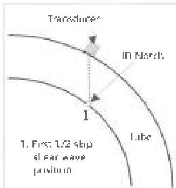
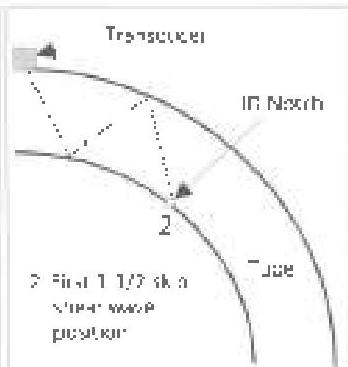

response or pipe condition that may warrant threshold adjustments and/or re-standardization. The threshold levels shall be recorded on the inspection logs.

## 3.30.4.5 WT Threshold Setting

Adjust the minimum threshold level of the wall thickness system such that the system generates an alert when the measured wall thickness is equal to or less than the specified minimum wall thickness plus 0.008 inch.

## 3.30.4.6 Dynamic Standardization

Scan the reference standard at production speed three times. The signal response amplitude from each reference standard notch as scanned in both directions shall exceed the applicable threshold on all three dynamic runs. The measured thickness of the reduced wall thickness section (as required in 3.30.2.2c) shall be within 0.005 inch of the actual wall thickness on all 3 dynamic runs.

## 3.30.4.7 Standardization Frequency

The unit shall be field standardized:

- At the start of inspection.
- After each 50 lengths or less.
- At least every 4 hours of continuous inspection.
- Each time the unit is turned on.
- When the instrument or a transducer is damaged.
- When the transducer, cable, operator, or material to be inspected is changed.
- When the accuracy of the last valid standardization is questionable.
- Upon completion of the job.

## 3.30.4.8 Invalid Standardization

If 3.30.4.6 is not met at any interval required by 3.30.4.7, all pipe inspected since the last valid field standardization shall be re-inspected.

## 3.30.5 Procedure

a. Record the serial number, OD, and wall thickness of the reference standard.
b. Distribute complaint on the contact surfaces through out the standardization and inspection processes.
c. Limit the pipe rotational and line speeds during inspection to the speeds used for dynamic standardization.

d. The gain may be increased above reference level during scanning to increase the sensitivity.
e. All indications that exceed the threshold levels shall be marked and proved up using the methods presented in 3.30.6.

## 3.30.6 Prove Up Methods

### 3.30.6.1 Prove-Up Inspection of WT Indications

a. Compression wave ultrasonic inspection shall apply for prove-up of low wall readings.
b. The inspection apparatus and standardization technique shall conform to the requirements in 3.30.2.4a.
c. The inspection area shall include the suspect location and the surrounding area as defined by the marking system accuracy in 3.30.2.1a, but not less than six inches from the suspect location.
d. Wall thickness readings shall be taken at a spacing not exceeding one reading per square inch in every direction.

### 3.30.6.2 Prove Up Inspection of TL &amp; Obl Indications

a. Shear wave ultrasonic inspection shall apply for prove-up of all flaw indications.
b. The inspection apparatus and standardization technique shall conform to the requirements in 3.30.2.4a.
c. For shear wave inspection, a distance amplitude correction (DAC) curve shall be established between the responses from an ID reference standard notch on the first 1/2 skip and 1-1/2 skip positions of the shear wave as shown in Figure 3.30.1.
d. The inspection area shall include the suspect location and the surrounding area as defined by the marking

Figure 3.30.1 Shear wave skip positions for establishing a DAC curve.

129