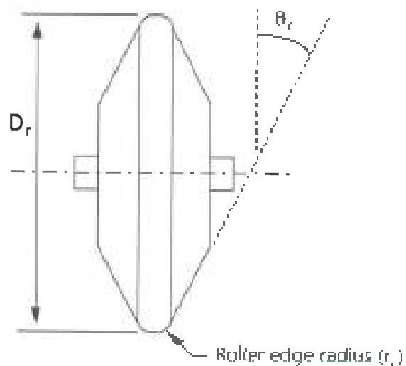
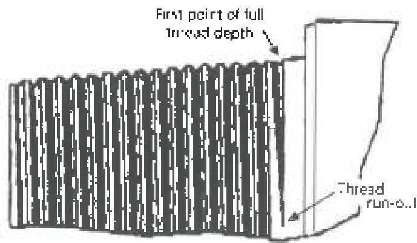

Figure 3.31.1 Roller Geometry

Figure 3.31.2 Pin thread run-out. Special care must be taken to ensure that full roller force is applied to the last machining marks in this area. The same consideration must be given to the first thread run-out.

Table 3.4.2 Required Hydraulic Pressure Given the Hydraulic Piston Diameter and the Required Roller Force for Cold Rolling API Connections

|   |   | Required Hydraulic Pressure (psi)  |   |   |   |   |   |   |   |   |   |
| --- | --- | --- | --- | --- | --- | --- | --- | --- | --- | --- | --- |
|  Hydraulic Piston Diameter (in) | 1/2 | 17189 | 16043 | 14897 | 13751 | 12605 | 10313 | 9167 | 8021 | 6875 | 4584  |
|   |  5/8 | 11001 | 10267 | 9534 | 8801 | 8067 | 6600 | 5867 | 5134 | 4400 | 2934  |
|   |  3/4 | 7639 | 7130 | 6621 | 6112 | 5602 | 4584 | 4074 | 3565 | 3056 | 2037  |
|   |  7/8 | 5613 | 5238 | 4864 | 4490 | 4116 | 3368 | 2993 | 2619 | 2245 | 1497  |
|   |  1 | 4297 | 4011 | 3724 | 3438 | 3151 | 2578 | 2292 | 2005 | 1719 | 1146  |
|   |  1 1/8 | 3395 | 3169 | 2943 | 2716 | 2490 | 2037 | 1811 | 1584 | 1358 | 905  |
|   |  1 1/4 | 2750 | 2567 | 2384 | 2200 | 2017 | 1650 | 1467 | 1283 | 1100 | 733  |
|   |  1 3/8 | 2273 | 2121 | 1970 | 1818 | 1667 | 1364 | 1212 | 1061 | 909 | 606  |
|   |  1 1/2 | 1910 | 1783 | 1655 | 1528 | 1401 | 1146 | 1019 | 891 | 764 | 509  |
|   |  1 5/8 | 1627 | 1519 | 1410 | 1302 | 1193 | 976 | 868 | 759 | 651 | 434  |
|   |  1 3/4 | 1403 | 1310 | 1216 | 1123 | 1029 | 842 | 748 | 655 | 561 | 374  |
|   |  1 7/8 | 1222 | 1141 | 1039 | 978 | 896 | 733 | 652 | 570 | 489 | 326  |
|   |  2 | 1074 | 1003 | 931 | 859 | 788 | 645 | 573 | 501 | 430 | 286  |
|   |  2 1/8 | 952 | 888 | 825 | 761 | 698 | 571 | 508 | 444 | 381 | 254  |
|   |  2 1/4 | 849 | 792 | 736 | 679 | 622 | 509 | 453 | 396 | 340 | 226  |
|   |  2 3/8 | 762 | 711 | 660 | 609 | 559 | 457 | 406 | 356 | 305 | 203  |
|   |  2 1/2 | 688 | 642 | 596 | 550 | 504 | 413 | 367 | 321 | 275 | 183  |
|   |  2 5/8 | 624 | 582 | 540 | 499 | 457 | 374 | 333 | 291 | 249 | 166  |
|   |  2 3/4 | 568 | 530 | 492 | 455 | 417 | 341 | 303 | 265 | 227 | 152  |
|   |  2 7/8 | 520 | 485 | 451 | 416 | 381 | 312 | 277 | 243 | 208 | 139  |
|   |  3 | 477 | 446 | 414 | 382 | 350 | 286 | 255 | 223 | 191 | 127  |
|   |  3 1/8 | 440 | 411 | 381 | 352 | 323 | 264 | 235 | 205 | 176 | 117  |
|   |  3 1/4 | 407 | 380 | 353 | 325 | 298 | 244 | 217 | 190 | 163 | 108  |
|   |  3 3/8 | 377 | 352 | 327 | 302 | 277 | 226 | 201 | 176 | 151 | 101  |
|  3 1/2 | 351 | 327 | 304 | 281 | 257 | 210 | 187 | 164 | 140 | 94  |   |
|  3 5/8 | 327 | 305 | 283 | 262 | 240 | 196 | 174 | 153 | 131 | 87  |   |
|  3 3/4 | 306 | 285 | 265 | 244 | 224 | 183 | 163 | 143 | 122 | 81  |   |
|  3 7/8 | 286 | 267 | 248 | 229 | 210 | 172 | 153 | 134 | 114 | 76  |   |
|  4 | 269 | 251 | 233 | 215 | 161 | 161 | 143 | 125 | 107 | 72  |   |
|   |   | 3375 | 3150 | 2925 | 2700 | 2475 | 2025 | 1800 | 1575 | 1350 | 900  |
|  Required Roller Force (lb)  |   |   |   |   |   |   |   |   |   |   |   |