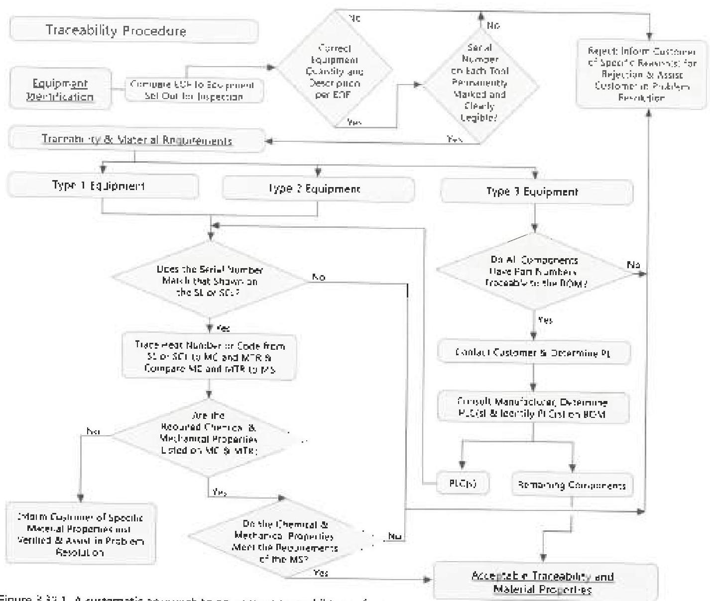

# 3.32.4 Definitions

The following definitions apply under this procedure:

**Equipment Order Form (EOF)**: A document prepared by the equipment supplier that provides the quantity and description of each tool required by the customer. This document will often be a rental or sales order depending on the nature of the transaction between the supplier and the customer.

**Material Specification (MS)**: A document that specifies the chemistry and mechanical property requirements for a material from which a tool or assembly component is manufactured. The MS is defined by the customer for every applicable component. (Examples: API Specification SDP, API Specification 7.1, and DS-1 Volume 1.)

**Serialization Log (SL)**: A document that is prepared by the drill pipe manufacturer and links each drill pipe assembly serial number to the cube and tool joint heat numbers or codes. A SL is also known as a traceability log.

**Serialization Cross-Reference Log (SCL)**: A document that is prepared by the equipment supplier and links the supplier's serial number to the manufacturer's original serial or heat number, which is traceable to the component's mill certificate and material test report.

**Bill of Materials (BOM)**: A document prepared by the equipment supplier that lists the required components for an assembled tool. Each component shall have a unique part number on the BOM.

Figure 3.32.1 A systematic approach to equipment traceability verification.