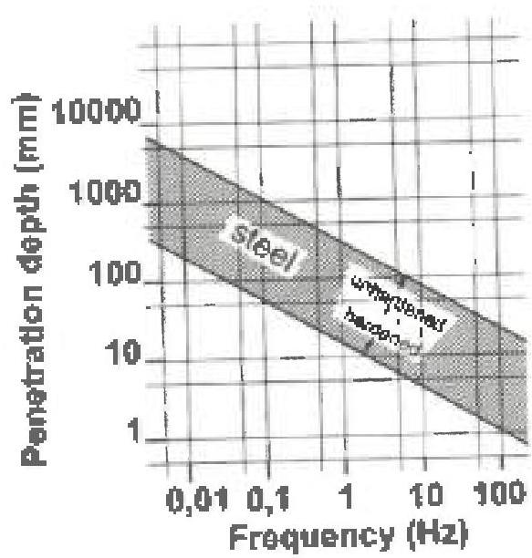

approximately 1 inch from the surface of the component. Measurements shall be taken at both ends and at 2-foot (±6 inches) increments along the longitudinal axis of components up to and including 10 feet in length. Components over 10 feet in length shall have measurements taken at both ends and at 3-foot (±6 inches) increments along the longitudinal axis. Additional readings may be taken at any other areas selected by the inspector or customer representative.

## 3.34.3.2 Demagnetization

One of the following techniques may be used to demagnetize components after inspection. The component must be subjected to a field equal or greater than that used to magnetize the part.

a. Demagnetization Using AC Yoke: AC yokes are effective demagnetizers for small or medium sized components.

- Small components are passed between the poles and slowly withdrawn while the AC yoke is still active. For AC yoke with adjustable legs, the space between the poles should be maintained as close to the component as possible.
- For larger components, the poles of the AC yoke are placed on the surface and the yoke is moved around as it is slowly withdrawn while it is still active.

Figure 3.34.1 Penetration depth of endy current. (Courtesy of Vallon GmbH)

b. Demagnetization Using AC Coil:

- Components are passed through the AC coil while it is activated and then slowly withdrawn from the field of the coil.
- Components must enter at a distance of 12 inches from the active coil and move through it steadily and slowly until the component is at least 36 inches beyond the coil.
- The above process is repeated as necessary until the residual field reaches an acceptable level.
- Demagnetization using an AC coil may also be achieved by placing the component within the coil and gradually reducing the magnetic field strength to a desired level.

c. Demagnetization Using DC Equipment: Demagnetization using DC equipment is recommended for larger components as an AC field lacks field penetration to remove internal residual magnetization.

- Starting current amperage shall be equal to or greater than the amperage used for magnetizing.
- Component is subjected to consecutive steps of reversed and reduced direct current magnetization until the desired level is achieved.
- Each step-down must last one second in order to allow the field in the part to reach a steady state.

## 3.34.4 Acceptance Criteria

The residual fields shall not exceed 3 gauss anywhere in the piece. Residual fields up to 10 gauss anywhere in the piece may be acceptable after an agreement between the vendor and the customer.

## 3.34.5 Post-Inspection Cleaning

Post-inspection cleaning is necessary where magnetic particles could interfere with subsequent processing or with service requirements. Suitable post-inspection cleaning techniques shall be used which shall not interfere with subsequent requirements.

## 3.35 Post-Inspection Marking

### 3.35.1 Scope

This procedure covers the post-inspection marking requirements of drill stem and workstring components. This procedure does not address marking of newly manufactured components.