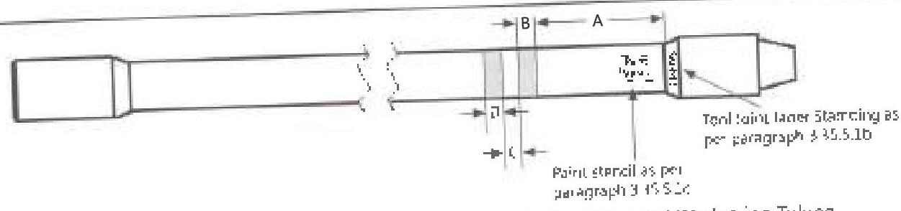
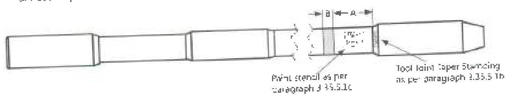
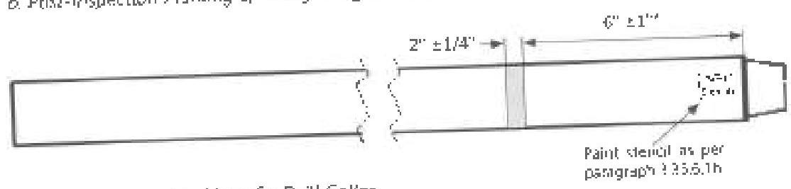

a. Post-Inspection Marking of Normal Weight &amp; Thick-Walled Drill Pipe and Workstring Tubing

b. Post-Inspection Marking of Heavy Weight Drill Pipe

c. Post-Inspection Marking of a Drill Collar
*For box × box components, paint band shall be placed 12" ± 7" from box shoulder
Figure 3.35.1 Post-Inspection Marking Scheme-A of Drill Stem Components

rejection of the defect as per Table 3.13.1. Reason for downgrade or rejection shall be written next to the band with a permanent marker.

b. Connections: All connections that are not acceptable shall have a 1-inch band painted on the connection OD adjacent to the shoulder depending on the condition. Depending on connection condition, color of the paint band shall be per Table 3.13.2. The reason for rejection shall be written on the part next to the paint band with a permanent marker for all damaged connections. The markings shall be removed after repair.

## 3.35.6 BHA Component Marking

This section applies to drill collar and other BHA components.

## 3.35.6.1 Marking Requirements for Scheme-A

a. Component Body: Place a 2-inch wide (±1/4 inch) white paint band around an acceptable component. The paint band should be 6 inches ±1 inch from the pin shoulder. The paint band should be 12 inches ±2 inches from the box shoulder for box × box components.

b. Paint Stencil Marking on BHA Components: Using a permanent paint marker on the outer surface of the component, write or stencil the words "DS-1 CAT (followed by number 1-5) Inspection," the date, and the name of the company performing the inspection. The letters "DS-1" and "CAT" (followed by number) are the inspection company's certification that the inspection was performed in compliance with this standard for the service category indicated. The paint bands signify that all parts of the BHA component meet the indicated requirements. Paint stencil marking shall be placed as near as possible to the pin shoulder for BHA component. The paint stencil marking should be 6 inches ±1 inch from the box shoulder for box × box components.