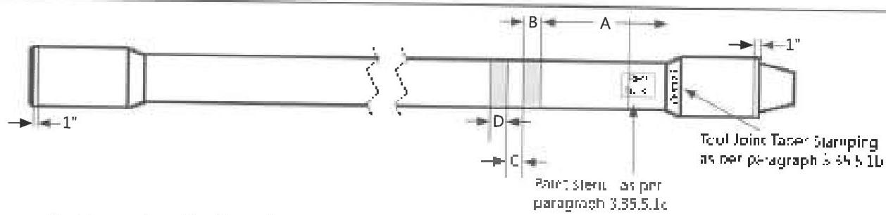
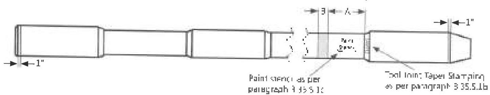
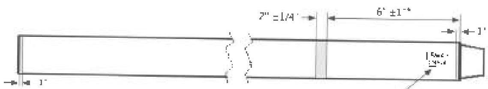

a. Post-Inspection Marking of Normal Weight and Thick-Walled Drill Pipe

b. Post-Inspection Marking of Heavy Weight Drill Pipe

c. Post-Inspection Marking of a Drill Collar
*For box = box components, paint band shaloc placed 12" + 2" from box shoulder.*
Figure 3.35.2 Post Inspection marking Scheme-B of Drill Stem Components

## 3.35.6.2 Marking Requirements for Scheme-B

In addition to the marking requirements specified in section 3.35.6.1, the following requirements shall be applicable for Scheme-B:

a. Component Body: The rejected parts shall have a red band painted around the defective area and the reason for rejection shall be written on the part next to the red paint band with a permanent marker.
b. Connection: All connections that are not acceptable shall have a 1-inch band painted on the connection OD adjacent to the shoulder depending on the connection condition. Depending on connection condition, color of the paint band shall be as per Table 3.13.2. The reason for rejection shall be written on the part next to the paint band with a permanent marker for all damaged connections that require field repair or shop repair. The markings shall be removed after repair.

## 3.36 Drift Testing

### 3.36.1 Scope

This procedure covers the drifting of workstring raking throughout its entire length to detect any reduction in the ID.

### 3.36.2 Inspection Apparatus

a. A drift mandrel shall be used to perform drift testing. The drift mandrel may be part of a rattler that is used for cleaning the internal surface of the tubing.
b. Any electronic, dial, or Vernier device used to verify the OD of the drift mandrel shall itself have been calibrated. See section 2.21 for calibration requirements. The measuring device shall also have flat contacts and be capable of measuring to a precision of 0.001 inch.
c. Fixed setting standards for field use shall be verified to an accuracy of ±0.002 inch using one of the devices listed in paragraph 3.36.2b.