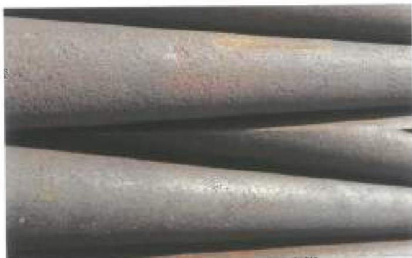
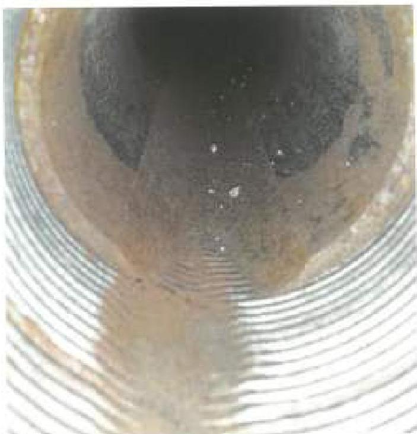
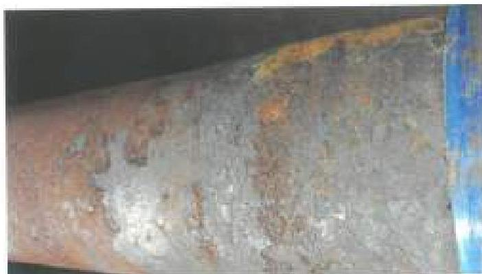

# 3.37.4 Procedure and Acceptance Criteria

a. The minimum illumination level at the inspection surface shall be 50 foot-candles. The light intensity level at the inspection surface must be verified:

- At the start of each inspection;
- When light fixtures change positions or intensity;
- When there is a change in relative position of the inspected surface with respect to the light fixture;
- When requested by the customer or a designated representative;
- Upon completion of the inspection.

Figure 3.37.1 Rejectable pitting on the ODs of joints of tubing.

Figure 3.37.2 Rod wear on the ID of a joint of tubing.

These requirements do not apply to direct sunlight conditions. If adjustments are required to the light intensity level at the inspection surface, all components inspected since the last light intensity level verification shall be re-inspected.

b. The external surface of the tubing shall be examined from end-to-end, not including the connections. Surface imperfections that penetrate the tubing body surface shall be marked and measured. Surface imperfections that do not meet the acceptance criteria of Table 3.11.1 shall be cause for rejection. The average adjacent wall thickness shall be determined by averaging the wall thickness readings from two opposite sides of the imperfection. Sample photos illustrating rejectable pitting on the OD are provided in Figure 3.37.1. Metal protruding above the surface may be removed to facilitate measuring the depth of penetration. Any visible cracks shall be cause for rejection.

c. The illuminated ID surface shall be visually examined up to at least 18 inches from either end. Identifiable rod wear shall be cause for rejection. An example of rod wear is included in Figure 3.37.2. ID pitting shall not exceed 1/8 inch as measured or visually estimated. If mill scale is found on either the OD or the ID, this is not cause for rejection. Sample photos of acceptable mill scale are included in Figure 3.37.3 and Figure 3.37.4. Corrosion scale, if present, shall be removed to facilitate the identification of pitting.

d. The ID surface of internally-coated pipe shall be examined for signs of deterioration of the Internal Plastic Coating (IPC). The tubing shall be classified as ID Coating Reference Condition 1, 2, 3, or 4 using the methods in section 3.4.5. Tubing with ID Coating Reference Condition 3 or 4 shall be rejected unless waived by the customer.

Figure 3.37.3 Acceptable mill scale on the OD of a joint of tubing.