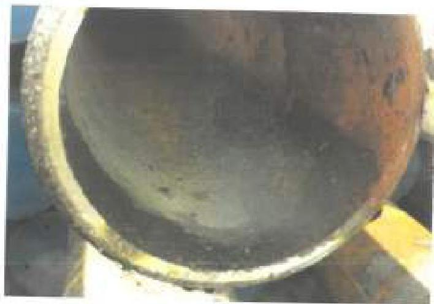
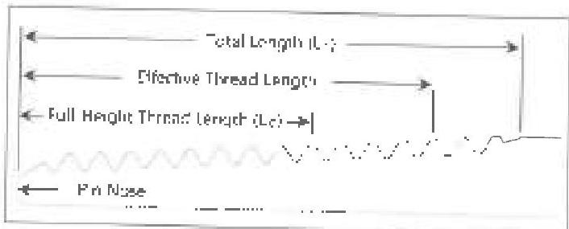
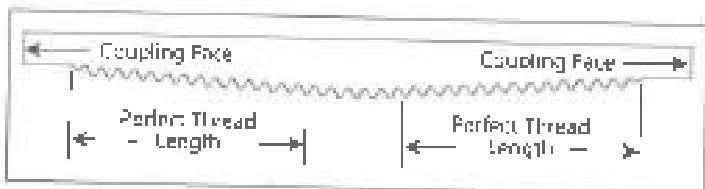

Figure 3.37.4 Acceptable mill scale on the ID of a joint of tubing.

e. The tubing shall not be visibly crooked by more than 3 inches over the entire length of the tube or 0.5 inch in the first 5 feet from either end. In addition to all applicable inspection, all straightened pipes shall be inspected in the straightened tube section and 2 feet either side of the straightened section in accordance with procedure 3.9, Magnetic Particle Inspection.

## 3.38 Workstring Visual Connection Inspection

### 3.38.1 Scope

This procedure covers visual examination of non-upper, externally-upper, and integral tubing connections to evaluate the condition of the connections.

### 3.38.2 Inspection Apparatus

A 12-inch metal ruler graduated in 1/64 inch increments, calibrated pit depth gage, calibrated API round thread profile gage, OD calipers, and calibrated white light intensity meter to verify illumination are required. See section 2.21 for calibration requirements.

### 3.38.3 Preparation

a. The minimum illumination level at the inspection surface shall be 50 foot-candles. The white light intensity level at the inspection surface shall be verified:

- At the start of each inspection;
- When light fixtures change positions or intensity;
- Where there is a change in relative position of the inspected surface with respect to the light fixture;
- When requested by the customer or a designated representative; and

- Upon completion of the inspection.

These requirements do not apply to direct sunlight conditions. If adjustments are required to the light intensity level at the inspection surface or if the light intensity is found to be less than 50 foot-candles when measured upon completion of the inspection, all components inspected since the most recent light intensity level verification shall be re-inspected.

b. All tubing shall be sequentially numbered.

c. Connections shall be clean so that no corrosion scale, mud, or lubricant can be wiped from the face of the connections or the thread surfaces with a clean rag.

### 3.38.4 Procedure &amp; Acceptance Criteria for API Round Tubing Connections

a. Cracks: All connections shall be free of cracks. Grinding to remove cracks is not permitted.

b. Full Height Threads: All threads within the L, distance measured from the pin nose, except the thread closest to the pin nose, shall have full crests or the connection shall be rejected. All threads within the Perfect Thread Length (PTL) distance measured from the face of the box, except the thread closest to the face of the box, shall have full crests or the connection shall be rejected. The L and PTL distances are given in Table 3.11.3 and Table 3.11.4 as well as illustrated in Figure 3.38.1 and Figure 3.38.2.

c. Thread Profile: The thread profile gauge shall be used as a reference to check for major imperfections to the threads. Four thread profile checks 90 degrees ±10 degrees apart shall be made. Examples of acceptable

Figure 3.38.1 Thread dimensions of an API round thread pin.

Figure 3.38.2 Thread dimensions of an API round thread coupling.

145