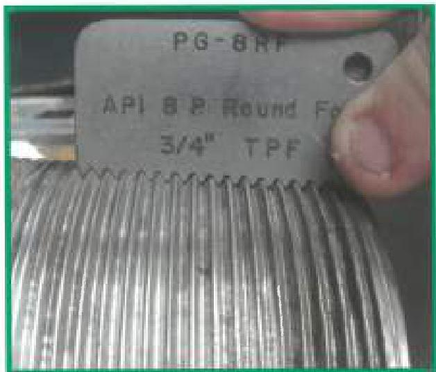
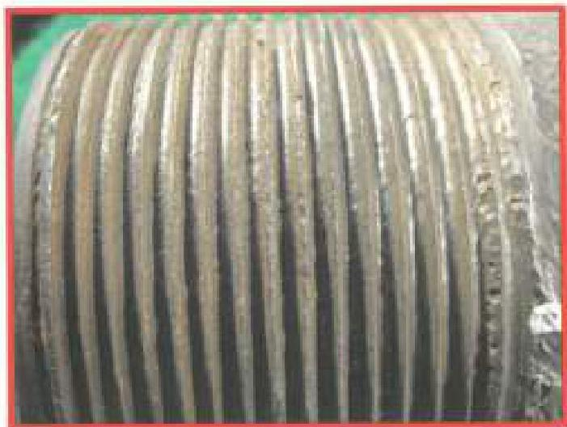
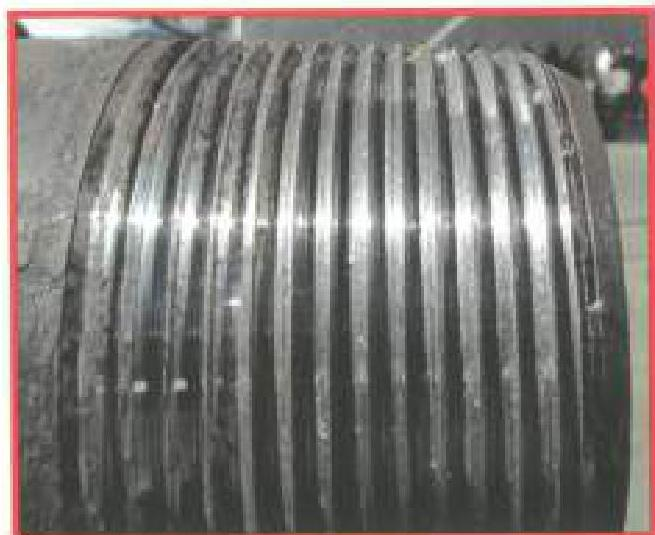
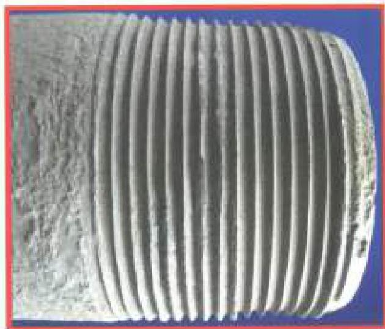

and rejectable thread conditions are shown in Figure 3.38.3—Figure 3.38.6.

d. Damages to Threads: All threads shall be free of raised metal, galling, missing threads, and pulled threads, or the connection shall be rejected. Thread surfaces shall be free of other imperfections or pitting that appears in occupy more than 1-1/2 inches in length along any thread helix, in exceed 1/32 inch in depth or 1/8 inch in diameter. Raised protrusions must be removed with a hand file or "soft" (nonmetallic) buffing wheel. The thread profile shall be checked after any buffing or cleaning of the threads using the thread profile gauge.

e. Box OD Imperfections: The depths of any pits, gouges, grip marks, or other imperfections on the OD of a box connection shall be measured using the pit depth gauge. If the result of subtracting the depth of the imperfection from the box OD is less than the minimum box OD given in Table 3.11.5, then the box connection shall be rejected. If a gouge has an adjacent metal protrusion, then the protrusion shall be removed prior to making a depth measurement.

f. Pin Nose Chamfer: A pin nose chamfer not present for a full (360 degree) circumference is cause for rejection. A thread root that runs out on the pin nose, a feather edge, or a knife edge (razor edge) is cause for rejection. Examples of these scenarios can be found in Figure 3.38.7, while a properly machined pin nose chamfer can be seen in Figure 3.38.1.

Figure 3.38.3 Acceptable thread condition.

Figure 3.38.4 Rejectable thread condition due to pitting

Figure 3.38.5 Rejectable thread condition due to deformation

Figure 3.38.6 Rejectable due to sharpened threads.