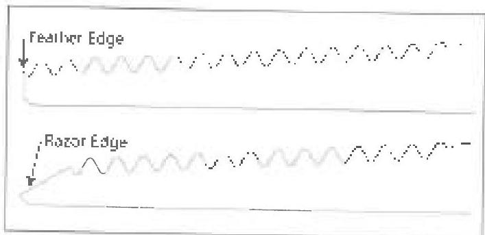
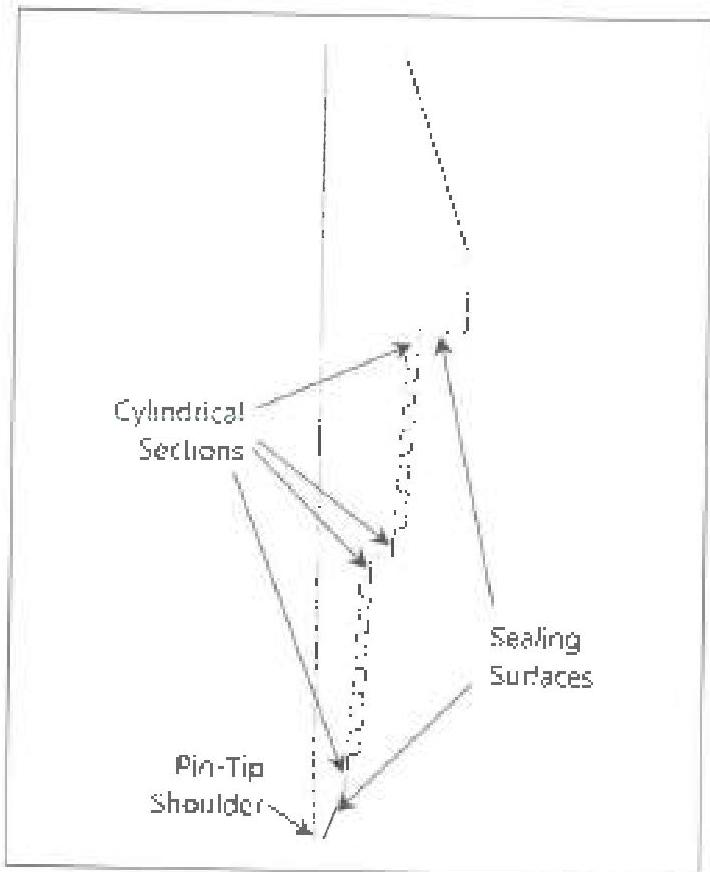
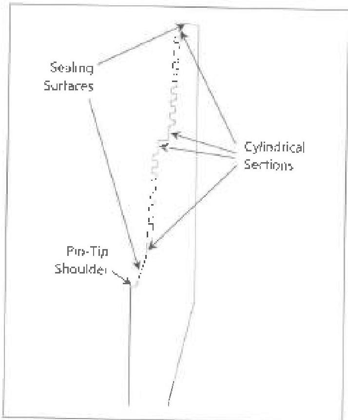

Figure 3.38.7 Improper pin nose geometry on API round thread pins.

## 3.38.5 Procedure and Acceptance Criteria for Shoulder Sealing, Two-Step Connections

a. Cracks: All connections shall be free of cracks. Grinding to remove cracks is not permitted.

b. Sealing Surfaces: The sealing surfaces are defined in Figure 3.38.8 for the pin connection and Figure 3.38.9 for the box connection. All sealing surfaces shall be free of raised metal or corrosion deposits detected visually or by rubbing a metal scale or fingernail across the surface. Any pitting, scratches, dents, or other interruptions of the sealing surface that exceed 1/32 inch in depth or occupy more than 20% of the sealing width at any given location are rejectable.

c. Threads: Thread roots shall be free of all pitting or the connection shall be rejected and/or repaired. Thread surfaces shall be free of other imperfections that penetrate below the thread root, occupy more than one inch in length along any thread helix, or exceed 1/16 inch in depth or 1/8 inch in diameter.

d. Pin-Tip Shoulder: The pin-tip shoulder is defined in Figure 3.38.8 for the pin connection and Figure 3.38.9 for the box connection. The pin-tip shoulder shall not be rejected for damages unless the damage affects the adjacent sealing surface so that it prevents the connection from meeting the requirements in paragraph 3.38.5b.

e. Cylindrical Sections: The cylindrical sections (which are not seal areas) are defined in Figure 3.38.8 for the pin connection and Figure 3.38.9 for the box connection. The cylindrical sections shall not have damage that occupies more than 50% of any single cylindrical section width.

f. Any apparent plastic (permanent) deformation due to overtorque is cause for rejection.

Figure 3.38.8 Shoulder-sealing, two-step pin.

Figure 3.38.9 Shoulder-sealing, two-step box.

147