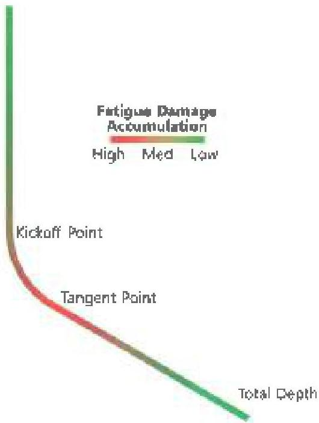

# Principle Objectives of Inspection

## Ensure Load Capacity

## Remove Fatigue-Cracked and Fatigue-Prone Components

Figure 2.2. The two principal objectives of drill stem inspection. One is easily accomplished at the rig, the other requires special equipment and training.

## 2.10 Inspector's First Objective

The first objective of the inspector is to ensure that each component has the load capacity required of it. This concern almost always applies to drill pipe, which usually has lower load capacity than heavier BHA components and is also subject to higher loads. For a given drill pipe size and connection, load capacity is established by pipe grade, tube wall thickness, and connection OD and ID. If it can be presumed that the initial inspection got these issues correct, then during future use the designer need only be concerned about accumulated wear on tool joint boxes and drill pipe tubes (pin IDs rarely change due to wear). Most importantly, the two dimensions critical to load capacity that are affected by wear can be quickly and easily re-measured right on the rig at no cost in rig time. Since the designer can readily reconfirm these dimensions when the need arises, there will rarely be a need to schedule a full re-inspection on the basis of wear considerations alone. An exception to this rule will occur when a string is about to be used in some critical situation such as a Design Group 3 or HDI S application in which design factors and projected load factors approach unity.

## 2.11 Inspector's Second Objective

The inspector's second principal objective is to identify and set aside components that contain fatigue cracks, or that are at elevated risk for forming them. Finding fatigue cracks on drill pipe is an activity requiring special equipment, best done by trained specialists who are not working under production pressures. Thus, unless rig operations are to be suspended for several days, the designer should probably plan on transporting drill pipe to a location or facility where inspection can be efficiently done. A possible exception will be inspecting BHA connections for fatigue cracks, which can often be done efficiently at the rig, provided the inspector is allowed to work independently of rig-driven production pressure.

## 2.12 Considerations for Scheduling Re-Inspection

Given that the initial inspection was correctly done, the factors that should determine when re-inspection is needed are accumulated fatigue and accumulated wear.

### 2.12.1 Fatigue

Accumulated fatigue damage on drill pipe tubes should determine when to schedule a re-inspection for drill pipe fatigue cracks. The difficulty here is that fatigue damage can accumulate at vastly different rates in different parts of the string. This is illustrated in Figure 2.3. Here, a hole section is to be drilled from the tangent point to the section total depth. With the bit rotating at the tangent point, fatigue cycles begin accumulating on drill pipe that is within the build section. However, as drilling progresses, pipe moves from the build section into the straight tangent section, and from the straight section above the kickoff point into the build section. Also, if the tangent section is not horizontal, tension in the build section increases with each foot of new hole. This accelerates the rate at which damage accumulates on pipe in the build section. Figure 2.3 shows the accumulated damage when drilling the hole section is complete. While pipe immediately above TD

Figure 2.3 Fatigue damage will accumulate unevenly over the length of a drill string.