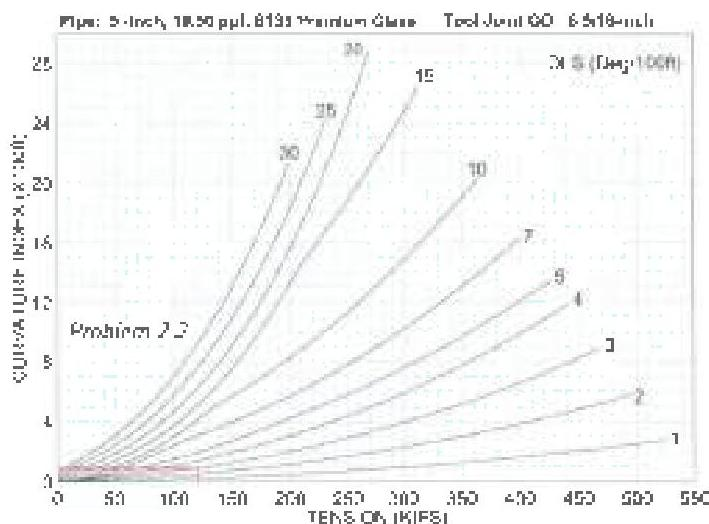

and in the straight section above the kickoff point have accumulated little or no damage, other sections, like the pipe at and immediately above the tangent point, will have significant damage. Other locations will have intermediate amounts of damage.

## 2.12.2 Load Capacity

Load capacity will be affected by wear on tool joints and tube bodies. Therefore, scheduling inspections for overload considerations should be done on the basis of cumulative wear.

## 2.13 Estimating Cumulative Fatigue Damage

To simplify the problem, the designer can separate the string into more than one section, then estimate accumulated fatigue damage on each, using Equation 2.1. Though this manual estimate will be very crude, it will be more useful for setting inspection frequency than any rule-of-thumb. The estimate is made by accumulating "damage points" on various sections of the drill string. Using this information, the designer can rotate component locations in the string to try to equalize damage, and schedule inspections based on the sum of accumulated damage points. The estimate takes into account average Curvature Index and number of cycles.

$$
DP = \frac{Cycles \cdot CI}{10^3} \cdot \frac{60 \cdot CI \cdot RPM \cdot I \cdot I_{0} \cdot I_{00}}{ROP \cdot 10^3} \quad \dots \dots \tag{2.1}
$$

Where:

- $DP$ = Fatigue "damage points" from one episode
- $CI$ = Average Curvature Index during episode
- $RPM$ = Average string rotation speed during episode (rev/min)
- $Foologie$ = Footage drilled during episode (ft)
- $ROP$ = Average rate of penetration during episode (ft/hr)

## 2.14 Inspection Scheduling

Inspection for fatigue cracks will be indicated when total cumulative damage points for a section reach a predetermined threshold. Limited data is available to set these thresholds. However, based on the hind cast of several failure analyses, the recommended beginning estimate would be to inspect when total accumulated damage points reach 500 for "critical" applications. Less critical situations could be handled with higher limits on damage points, such as shown on the table below.

|  Drilling Conditions
(Design Group) | Inspection Trigger
(Cumulative Damage Points)  |
| --- | --- |
|  3 | 500  |
|  2 | 600  |
|  1 | 700  |

The designer should remember that this manual estimating method is very crude. However, it is an improvement over running footage drilled or hours rotated, as it takes into account the relative severity of the drilling conditions. More accurate estimates can be obtained using a computer program designed for the task.

### Example Problem 2.2, Scheduling Inspection for Fatigue Cracks:

The designer drills the hole section in Figure 2.3 from the tangent point to section TD in 10 ppg mod. He uses 5-inch, 19.50 ppg, grade 5, Premium Class drill pipe. The wellbore kicks off at 3,000 feet and builds to 60 degree hole angle at a 3 degrees per 100 feet build rate. In this scenario, each joint of drill pipe that traverses the build section travels 2,000 feet within the build section where combined tension and bending are imposed while rotating. The joint of pipe that enters the build with the bit 2,000 feet from TD will experience the largest combined tension and bending while traversing the build section. Based on a torque and drag estimation, assume this 2,000 foot section experiences an average tension of 120,000 lb and is subjected to an average rotating speed of 120 RPM and an average ROP of 50 feet per hour. How many fatigue damage points accumulate on the drill pipe that reaches the tangent point when the bit reaches section TD?

Figure 2.4 Curvature Index for 5-inch, 19.50 ppg, grade 5, Premium Class drill pipe for example problem 2.2.