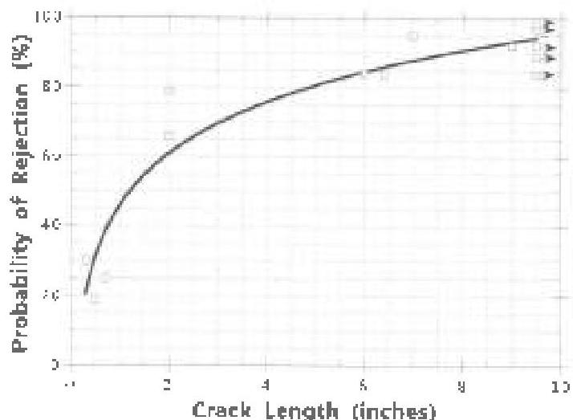

this one. Some are directly related to performance, others loosely related, and a few hardly related at all. The designer should understand them, as they directly bear on the fitness of the drill string for an intended use. Whether or not to raise or lower them for a particular application, and the confidence that can be taken in the adjustment, will depend upon the attribute in question and the circumstances of the application. Chapter 5 covers these points in detail.

## 2.26 The Inspection Procedure is Critical

The designer will rarely be knowledgeable about the technical minutiae of inspecting a drill string, just as the inspector will rarely be able to design one. Yet the designer and his organization have much at stake in whether or not the drill string actually possesses the attributes called for. Stated another way, the designer and his organization have much at stake in whether or not the inspector accurately sorts the components being inspected. How well the inspector does his or her job will depend in large part on what procedure is followed during the inspection. Procedure sensitivity was well illustrated in a landmark study by Moyer and Dale. These men used commercial inspection companies to examine several pieces of drill pipe and drill collars that were in various states of wear and fatigue. They did not materially interfere with the inspectors, but simply recorded their findings and plotted the probability that the inspectors would find the flaws they knew existed. In one facet of the study, Moyer and Dale evaluated the probability that inspection companies would find cracks in drill collar connections. The acceptance criteria allow no fatigue cracks in connections, no matter how small, so the test provided a good measure of commercial blacklight inspection. The result is shown in Figure 2.5. The test subjects had about a one in four chance of finding small cracks. Their chance of finding cracks increased to eight to nine in ten when the cracks were very large.

## 2.27 Procedure Affects Results

An interesting twist to the data in Figure 2.5 is this: the investigators used the same technique they were studying, blacklight inspection, to establish the existence of a crack, against which they evaluated commercial inspections. The investigators, however, examined the connections using the best available practices and under no production pressure. So Figure 2.5 does not evaluate the absolute quality of commercial blacklight inspection for finding cracks. In reality, it compares the relative quality of commercial blacklight inspection done at the time (data points) against blacklight inspection done properly by the investigators. Stated another way, the blacklight practices used by the investigators were 10–20% more likely to find very large cracks and four hundred percent more likely to find very small cracks than the commercial subjects. This "procedure sensitivity" is present in all nondestructive inspections. It is the reason mandatory inspection procedure control steps are written in Volume 3 of this Standard. Reference 1 also discusses the degree of "control" for an inspection process. This is illustrated in Figure 2.6. The acceptance criteria demanded, expressed in flaw size, is shown by the heavy black line. However, a real-world inspection will not be able to attain the ideal. Because of inspection uncertainty, some good material will be rejected, and some bad material accepted. Figure 2.6 (center) shows a real inspection sort that was run with a well-controlled procedure like the investigators in reference 1 used. A well-controlled inspection procedure can provide results that approximate (but can never match) the theoretical sort demanded by the acceptance criteria. As procedure control deteriorates, the results move further away from ideal, resulting in more acceptance of substandard material, and higher probability of downhole problems. This reality is especially problematic in drill string inspection, where inspections are priced on a "piece work" basis and often competitively bid by customers who may have little understanding of what they're purchasing. No matter how well qualified and motivated an inspection organization may be, these market pressures leave them no alternative but to "imery" in order to make money. The resulting loss of procedure control, and the detrimental results on inspection

Figure 2.5 Probability of detecting a drill collar connection fatigue crack as a function of crack size. (from Reference 1)