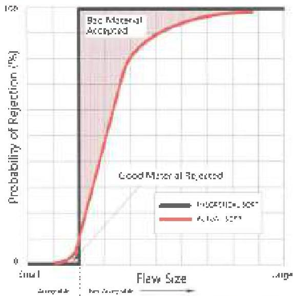
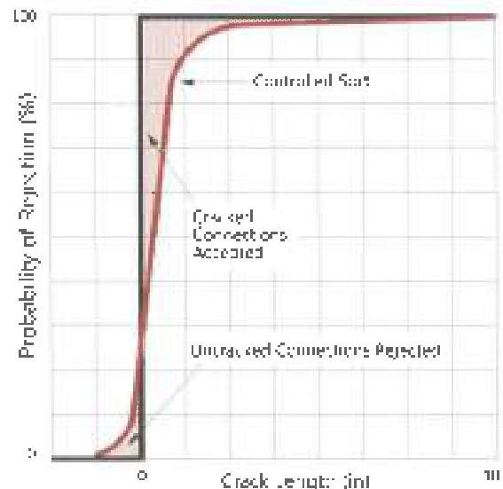
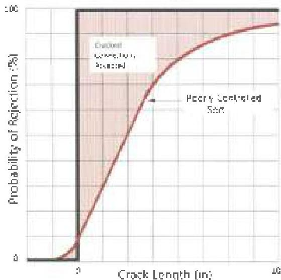

Figure 2.6 Real inspection can never attain the ideal sort demanded by the acceptance criteria in effect (top). However, a well controlled inspection procedure (center) more closely approximates the ideal than a poorly controlled procedure (bottom)

quality, far outweigh the few dollars the customer saves on inspection cost. Customers who focus only on minimizing inspection costs do not allow the inspection organization time to do a good job and still make money. Such customers are subverting their own interest, and share in the blame if the quality of the inspection they receive does not meet their expectations.

## 2.28 Frequently Asked Questions

DS-1 has become widely accepted as the standard for inspecting drill string components. Several questions are commonly asked about using the standard. These questions are answered here:

Q: What specific drill stem components are covered by DS-1 Volume 3 inspection procedures?

A: The Fifth Edition of Volume 3 of the standard covers used normal weight drill pipe, thick-walled drill pipe, HWDP, workstring tubing, drill collars, pup joints, API and similar rotary-shouldered connections, a number of proprietary connections, kellys, subs, stabilizers, and single-piece fishing tools.

Q: Standard DS-1 Volume 3, Third Edition used to provide procedures for inspecting certain drilling specialty tools like jars, MWD/LWD, motors, etc. Can I continue to use DS-1 Volume 3, Fifth Edition for inspection of used drilling specialty tools?

A: No. Standard DS-1 Volume 3, Fifth Edition does not cover qualification of drilling specialty tools. Inspection and qualification of drilling specialty tools is now covered by Standard DS-1 Volume 4, Fifth Edition. However, since Standard DS-1 Volume 3, Third Edition previously covered qualification of certain drilling specialty tools, vendors of drilling specialty tools may be requested by their customers to follow requirements specified in Standard DS-1 Volume 3, Third Edition for Category 3-5 (or lower) for these tools. In this event, the vendor shall meet this request by following the requirements specified in Standard DS-1 Volume 4, Fifth Edition for tool Class A1

Q: How does a DS-1 inspection differ from an API inspection?

A: Unfortunately, neither one of the two terms in this question has any precise meaning, so the question cannot be answered. The term "API inspection," although frequently used by people in the industry, has no precise meaning unless it is referenced in API RP7G-2 and an