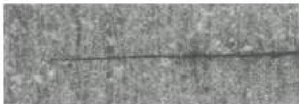
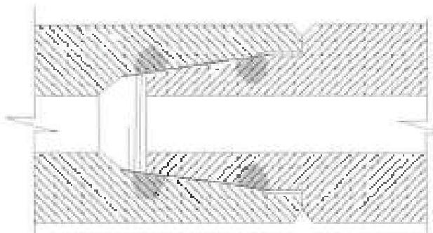
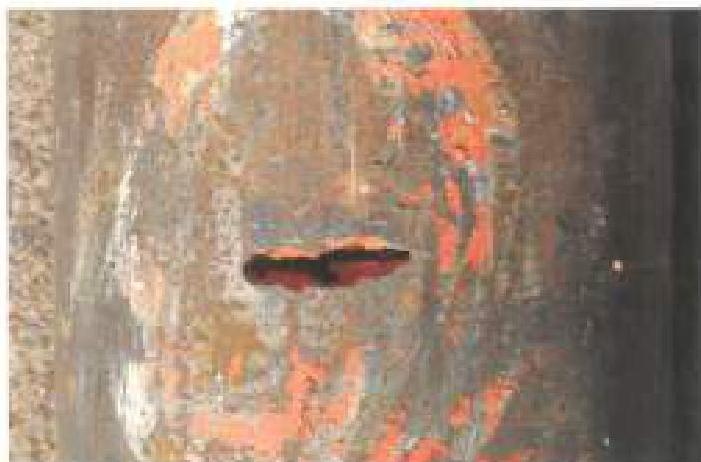
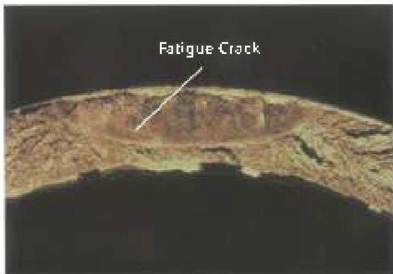
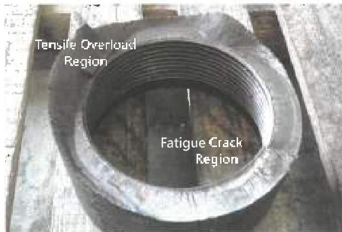
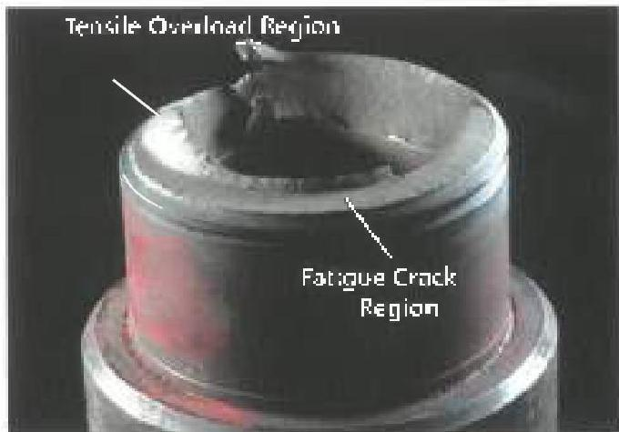

Figure 4.1 A drill pipe tube fatigue crack. (x100)

Figure 4.2 Fatigue cracks in BHA connections occur in the regions of highest tensile stress (shaded above). In drill pipe tubes, most fatigue cracks form in stress concentrations from slip cuts and from internal upsets.

to fatigue are the end connections on stiff BHA components and midbody connections on specialty tools like jars and motors. Fatigue is more likely on connections that join stiff components, and less likely on those joining further components.

c. Other Locations: Fatigue cracks also occur in the slip grooves on drill collars, in stabilizer bodies (often near welds on welded blade stabilizers), and in other locations where the drill string undergoes a sharp section change.

## 4.4.2 Appearance of Fatigue Failures

Fatigue often has a characteristic appearance that differentiates it from overload failures.

a. Tubes: A fatigue crack will be planar and perpendicular to the pipe axis. If the crack has penetrated the tube wall, leaking drilling mud often erodes the crack into what is called a tube "washout" (Figure 4.3). Even when eroded by drilling mud, however, the fatigue crack usually retains its transverse orientation.

Figure 4.3 "Washouts" in drill pipe tubes are almost always caused by fatigue.

Figure 4.4 Brittle material may fail before the crack penetrates the pipe wall

Figure 4.5.a Typical fatigue failure in a drill collar box.

Figure 4.5.b Typical fatigue failure in a pin connection