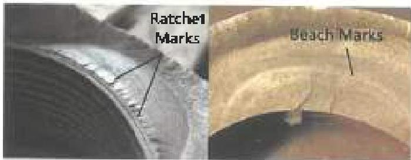
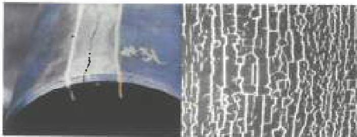

Figure 4.6 Ratchet marks on the fatigue crack surface of a drill collar box (left). Beach marks on a box fatigue crack (right).

On very brittle drill pipe, sudden catastrophic fracture can occur before the crack is large enough to have penetrated the tube wall (Figure 4.4).

b. Connections: Fatigue cracks in connections will be flat, planar, and perpendicular to the pipe axis. The fatigue crack surface may be worn smooth. The crack surface may also be washed and erected by leaking mud, and mechanical damage from fishing operations or from rotating parted surfaces on one another is often seen. If a string separation has occurred and the surfaces are relatively undamaged, the fatigue crack surface will occupy less than the entire fracture face. The remainder will have parted when the fatigue crack grew too large for the remaining sound metal to carry the applied load. This non-cracked portion of the fracture often has the 45 degree orientation typical of tensile overload (Figure 4.5). The non-cracked part may also show a fair amount of plastic deformation, but little plastic strain will be associated with the fatigue crack itself. The relative sizes of the cracked and non-cracked surfaces of a fracture will vary depending on material properties and loads, though tougher material will support larger cracks without parting, other things equal.

## 4.4.3 Other Indicators of Fatigue

If a fracture or washout exhibits the features above, it was almost certainly caused by fatigue. Occasionally, a connection fracture may be recovered that is neither mechanically damaged nor severely corroded. If so, other indicators may be present on the fracture surface that will further establish fatigue as the failure mechanism.

a. Ratchet Marks: Ratchet marks are small steps in a connection fatigue crack face near the thread root. Ratchet marks occur when many small cracks initiate and begin growing in the thread root from slightly different positions. As the small cracks grow, they join together to form one large crack, but leave small

Figure 4.7 A split box failure (left) is often associated with superficial box cracks called "heat checks" (shown at the right under blacklight).

steps and depressions (ratchet marks) at the edge of the crack (Figure 4.6).

b. Beach Marks: Beach marks are impressions that may occur on a fatigue crack surface when the part undergoes a sudden change in crack growth rate, perhaps from going into and out of service. Examples are shown in Figure 4.6. Beach marks, though less common and more difficult to see than ratchet marks, are sometimes visible when the surface has not been corroded.

## 4.5 Split Box

This is a special type of fatigue that occurs when tool joint boxes are operated under high Curvature Index conditions. A split box failure is often accompanied by heat checking that results from the same high side loads. Heat checks (Figure 4.7) are superficial longitudinal cracks which, though not detrimental in themselves, cause stress concentrations that speed the formation of the longitudinal split box fatigue cracks. Unlike boxes that split from overrefacing and torsion overload, split box fatigue failures like the one in Figure 4.7 show little or no plastic deformation.

## 4.6 Corrective Actions

Fatigue is a complex mechanism, and efforts to prevent it should encompass a wide range of actions. Details are given in Chapter 4 of Volume 2. A summary flowchart is shown in Figure 4.8.

## 4.7 Torsion Failure

Torsion failure can occur in a tool joint or drill pipe tube, though the former is more common because API connections of standard dimensions are weaker in torsion than the tubes to which they're attached. The only time that externally applied torsion will affect a connection will be when the load is high enough to cause relative torsion between pin and box. If the applied torsion is not sufficient