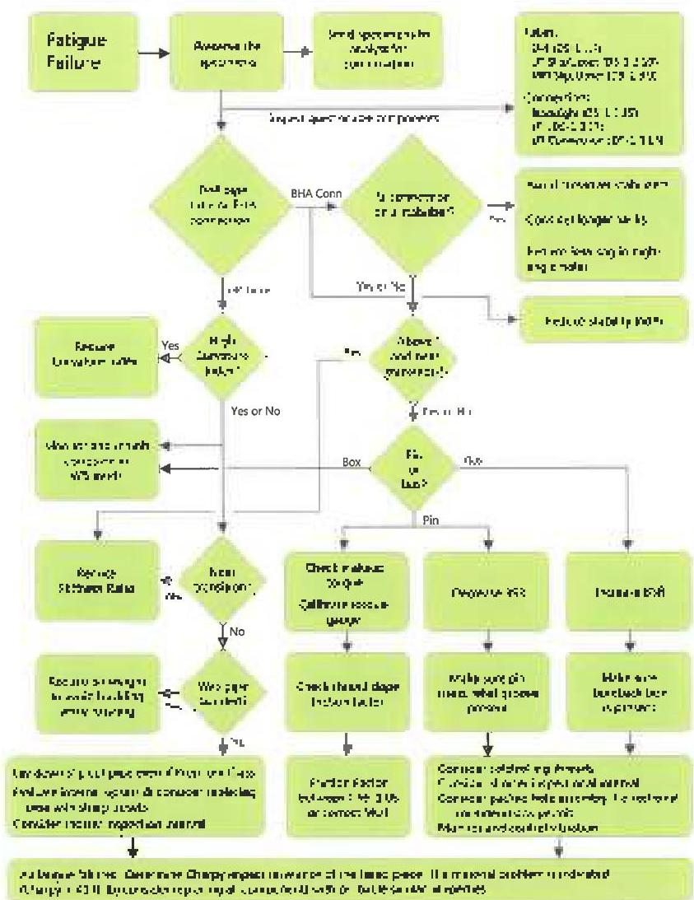
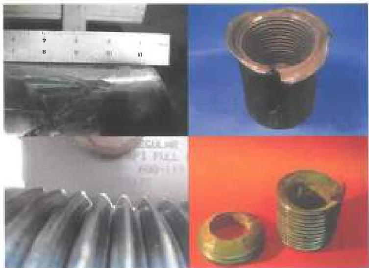

Figure 4.8 An overview of collective actions to consider in case of fatigue failure. Detailed instructions are found in Volume 2, Chapter 4.

Figure 4.9 Box-weak torsion failure begins as box swell (top left) and may progress to the extreme stage at top right. Pin weak torsion failure starts as pin stretch (bottom left) and may progress until final separation of the pin neck (bottom right).

to cause pin-box movement, it is transmitted through the connection with no significant effect on connection stress.

## 4.7.1 Failure Location

Because torsion is applied from the surface, connections higher in the hole are more likely to fail, although variations in strength or dimensions from one tool joint to the next may affect this. Also, BHA connections are typically stronger than the tool joints alone, so torsional failures in BHA connections are rare except when "slim" components are used or when the BHA is under torsional vibration (stick-ship) conditions.

## 4.7.2 Appearance

A connection torsion failure will first show up as a stretched pin or belled box, depending on which is weaker. In extreme cases, the pin may be parted or the box split. A box that is split by torsion alone (not fatigue) will also exhibit heavy plastic deformation and belling (Figure 4.9).

## 4.8 Preventing Torsion Failure

Torsion failure is an overload mechanism that occurs when the stress in the weaker of connection pin or box exceeds yield stress. Torsion failure can be averted using the actions outlined in Chapter 3 of Volume 2.

## 4.8.1 Calibrate Torque Application Devices

If a torsional failure occurs, or if operating torques are expected to approach tool joint makeup torque, you should make sure the makeup torque application devices are calibrated.

## 4.8.2 Check Tool Joint Diameters

Tool joints purchased by contractors and rental companies often do not comply with "standard" dimensions found in A1. This is particularly true with respect to the ID. There is no particular problem with nonstandard dimensions as long as you check the actual dimensions with which you're dealing and adjust load capacities accordingly.