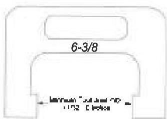
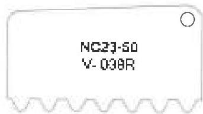
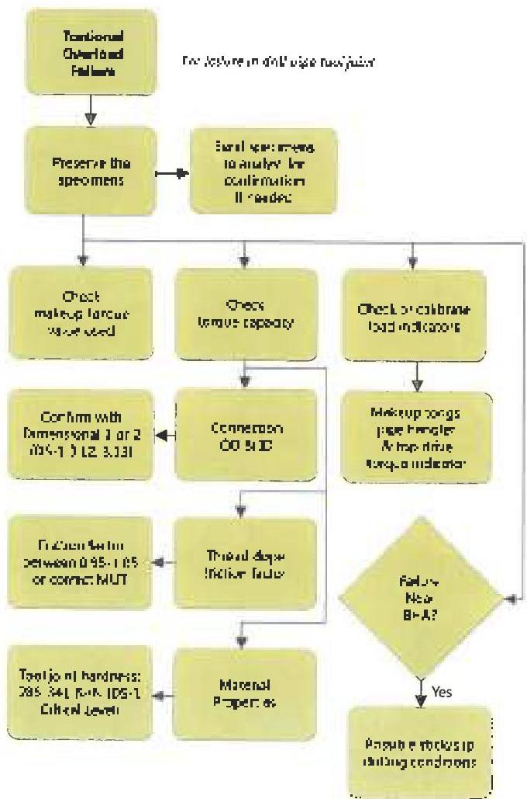

## 4.8.3 Monitor Tool Joint Wear and Condition

If you anticipate drilling with high side loads or long reaches, you should establish a box wear tolerance. Set the minimum tool joint OD at the dimension required to maintain torque load factor below the maximum allowed. Pin wear is usually ignored. Dynamic torque indicators may not be very accurate, so if torque load factor is approaching the limit, you should monitor the condition of tool joints near the surface, at section tops and those that have recently been rotating at high side loads. This can be done on trips out of the hole, and will show whether the connections have been or are about to be overstressed. Use the Rig Floor Trip Inspection, procedure 3.33. Alternatively, you can use dividers or a gage similar to the one shown on the left in Figure 4.10. Set the dividers or gage at the wear limit and attempt to place it on tool joints as they pass through the rotary. A tool joint over which the gage will slide is worn past the limit. On pin-weak connections, check pin lead with a hardened and ground profile gage (Figure 4.10) to make sure they are not being overstressed. This, stamped "tool joint identifiers" are not recommended for checking pin lead.

## 4.8.4 Note Break Out Torque

Break out torque could normally be 10-15 percent higher than makeup torque because of the difference in static and dynamic friction coefficients. Break out torques significantly higher than this may indicate downhole makeup. This could warn of pending torsion overstress and failure as the hole gets deeper and operating torque continues to increase. Figure 4.11 gives a systematic approach for dealing with a torsional failure.

## 4.9 Tension Failure

In deep, vertical and near vertical holes, tension is usually the load of primary concern. Tension failure is an overload mechanism whose identification and prevention is relatively straightforward.

Figure 4.10. A gage for checking tool joint box wear (left). Hardened and ground profile gage for checking pin stretch (right).

## 4.9.1 Location

A tensile failure will probably occur in a drill pipe tube between upsets, near the surface or a section top. However, variations in wall thickness and tensile strength between tubes can place a tensile failure at other locations. Tensile failures in tool joint pins are rare because pin necks on most standard sized tool joints have cross sections capable of carrying both makeup-induced stress and external string tension. Exceptions to this can occur, and pin neck tensile capacity can be degraded by excess makeup torque, as described in Chapter 3 of Volume 2.

## 4.9.2 Appearance

Tension failures are often jagged in appearance, and the tube is usually necked down or "bottlenecked" near the fracture. Tension fracture surfaces often show extensive plastic deformation, though in brittle material this may not be the case. The fracture surfaces will be oriented 45 degrees.

Figure 4.11. A systematic approach for responding to a torsional failure.