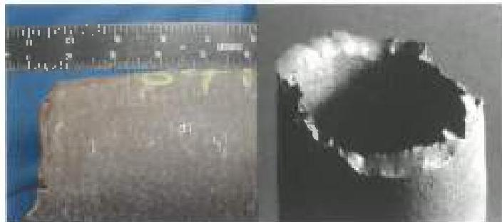
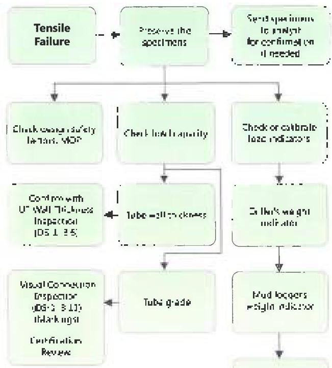
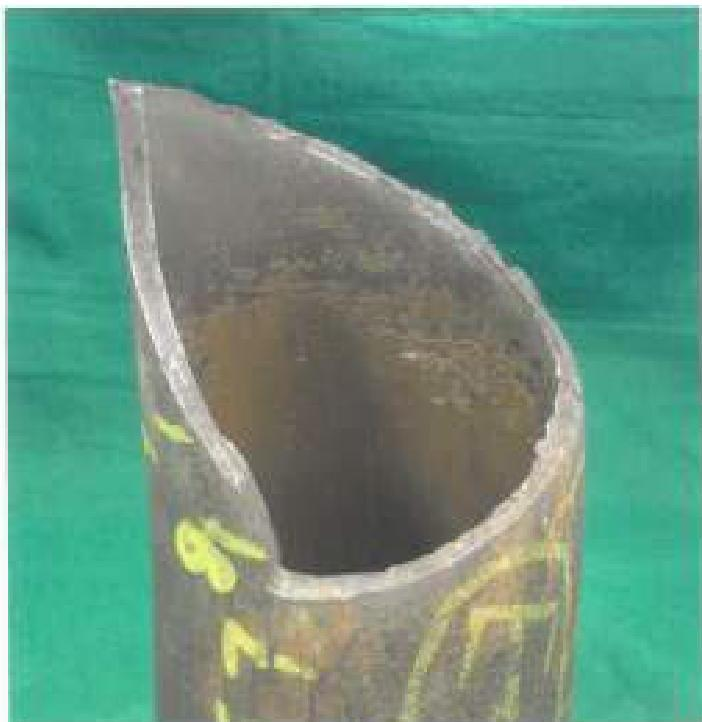

to the axis of the pipe (Figure 4.12) unless the material is very brittle. Figure 4.13 shows a systematic approach for correcting a tension failure.

## 4.10 Combined Loads

Tension and torque loads interact, and the capacity of a component to carry the loads simultaneously will usually be less than the capacity to carry either load individually. Combined load capacities are given in Volume 2, Chapter 3. Failure by combined tension and torsion may occur in tubes or tool joint pins. Tool joint boxes will not fail by this mechanism because pin failure will occur first. In drill pipe tubes, the failure will usually display the plastic deformation and necking down that characterize a tensile failure. A helical fracture surface like that shown in Figure 4.14 may also be present. In tool joints, the appearance of a combined load failure will be much like that of a pin torsional failure. In the early stages, a stretched pin, and in extreme cases, total pin separation, will be the indicators.

## 4.11 Sulfide Stress Cracking

Sulfide stress cracking failures in drill strings are relatively rare. The mechanism is very complex, and identifying it is probably best left to professional failure analysts. A higher tensile stress state, higher H₂S concentrations, lower pH, higher pressure, higher chloride concentration, lower temperature, and harder material all promote SSC attack. Conversely, moving one or more of these factors in the opposite directions will retard attack, other things equal. Possible sources of hydrogen sulfide in drilling fluids may include formation fluid, bacterial activity, or breakdown of chemicals in the drilling fluid. Of these, formation fluid is obviously the most concern. Prevention of the SSC mechanism is outlined in Chapter 5 of Volume 2.

Figure 4.12 Tension failure appearance.

Figure 4.13 A systematic approach for responding to a tension failure.

Figure 4.14 The fracture surface of combined load failure in a drill pipe tube may have a helical shape.