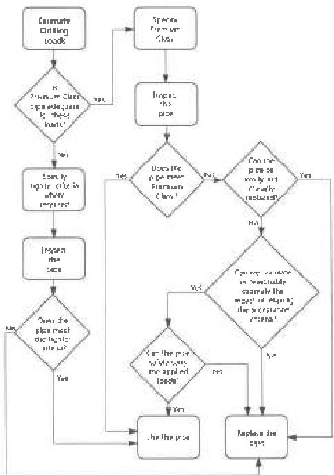

## 5.2.3 Recognition of "Premium Class, Reduced TSR" (Torsional Strength Ratio)

A few drill pipe/tool joint combinations with undersized tool joint ODs (but Premium Class in every other respect) are still used widely. For these combinations, the industry seems to prefer a slimmer tool joint for fishing clearance, and is willing to accept a nominal reduction in torsional capacity to gain the increased clearance. An example is 3-1/2 inch, 13.30 ppt, Grade S pipe with NC38 tool joints. A new tool joint built to API standard dimensions has a 5-inch outside diameter. A tool joint worn to no less than 4-13/16 inches OD is Premium Class. Yet rental companies still purchase pipe with 4-3/4 inch tool joints to meet their customers' needs for more clearance. Thus, these tool joints are often manufactured with Class 2 dimensions, which wear will certainly reduce further. This is "fitness for purpose" in action. When the artificial standard (Premium Class) did not meet the required performance need (fishing clearance), the industry informally changed acceptance criteria to meet the need. For these particular items, the inspection community has for years applied an informal, unregulated set of tool joint diameter requirements, while more or less rigorously enforcing other requirements. To recognize and to establish some control over this practice, DS-1 sponsors have adopted a new class called "Premium Class, Reduced TSR."

## 5.2.4 Application of Grouped Attributes

"Ultra Class," "Premium Class," "Premium Class, Reduced TSR," and "Class 2" are labels that fix several attributes of normal weight drill pipe and the tool joints attached to normal weight drill pipe. These labels have no meaning in reference to any other drill string component. For all other components, attributes are specified singly.

## 5.3 Fitness for Purpose

### 5.3.1 Definition and Application

"Fitness for Purpose," in this standard, means adjusting the inspection acceptance criteria to fit an intended application. The occasional need to modify acceptance criteria arises from the fact that those criteria in use were not established to meet any specific sets of drilling conditions. Thus, a given set (for example: Premium Class) will not fit every drilling situation. If the criteria are too stringent, forcing drill stem components to comply with them needlessly drives up drilling cost. On the other hand, high drilling loads may demand more robust equipment. In these cases, acceptance standards need to be tighter.

### 5.3.2 How to Use This Section

Figure 5.2 outlines a general process which the user of this standard can apply to modify acceptance criteria and achieve fitness for purpose. It is envisioned that users will continue the practice of specifying "Premium Class" (or "Premium Class, Reduced TSR") unless drilling loads demand more stringent standards. This section may be used as a resource to handle one of two specific situations:

a. If Premium Class attributes are too loose for the well under consideration and the user needs guidance on how to tighten them selectively. The pipe will then be inspected to the tighter standard.

b. If Premium Class or Premium Class, Reduced TSR are adequate for the application and one of these is specified, however, the pipe fails to pass inspection. If this occurs and pipe replacement costs are very high, the user may be able to save money by selectively loosening criteria to make the pipe in hand acceptable. Of course, the lower limits must still provide adequate operating safety margins.

Figure 5.2 Typical process for using this approach.