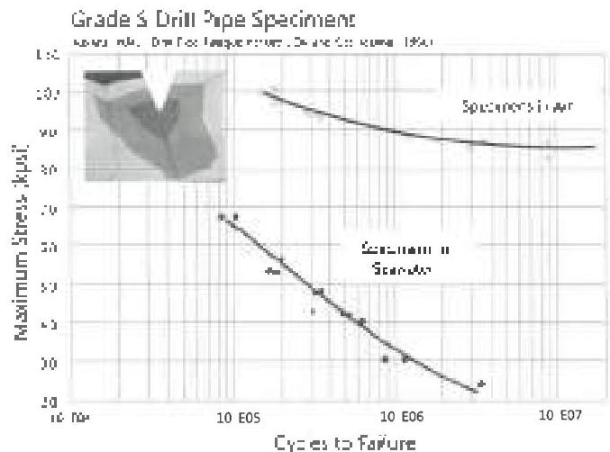

Figure 5.3 Slip cuts accelerate fatigue attack. The inset shows a FEA model of a 10 percent slip cut on 4-1/2 inch 16.60 ppf drill pipe subject to tension and bending. Stress at the bottom of the cut in this model is about 80 percent higher than bulk stress in the pipe. The actual effect of cuts will vary with the bulk stress and the environment, but will be more significant in more aggressive environments. (Curve: Reference 1, Inset: Reference 2)

Inspection: Visual Tube, EMI, FLUT, MPI Slip/Upset, UT Slip/Upset

## 5.6.3 Raised Metal in Slip Area

Type: C

Basis: Raised metal in the slip area increases the possibility of damaging blowout preventer elements when stripping or snubbing. Such damage could lead to premature failure of the elements and possible well control problems.

Required: Raised metal must be removed or the tube rejected.

Reference: DS-1: Visual Tube inspection procedure. (RP7G-2 does not address this attribute.)

Effects: Protrusions on the pipe surface will increase the possibility of damage to rubber elements in blowout preventers or stripper heads when the elements are energized and pipe is passing through them.

Adjustment: Adjustment is not recommended.

Inspection: Visual Tube

## 5.6.4 Unprovable Repetitive NDT Indications

Type: C

Basis: This requirement prevents accepting a joint of pipe containing a possibly injurious flaw that is not accessible for quantitative measurement.

Required: A repeatable flaw indication that exceeds the standardization reference level of the inspection method being used, and that is inaccessible for mechanical measurement, must result in rejection.

Reference: DS-1: EMI, FLUT, UT Slip/Upset inspection procedures (RP7G-2 does not address this point.)

Effects: --

Comments: The mere presence of a fatigue crack is cause for rejection, and other types of flaws cause rejection if they exceed certain sizes. Unfortunately, inspection devices that scan for flaws, such as EMI and ultrasonic unia, cannot, because of their inherent technical limitations, give an accurate quantitative readout of either flaw type or size. Therefore, these units are useful only to indicate that a flaw may be present at some location on the pipe. Subsequent "prove-up" inspection is required to pinpoint the flaw and determine its type and severity. But unless these flaws are accessible to the inspector, they are impossible to prove up. Therefore, if a flaw is inaccessible, but consistently shown in repeated scans, the standard for rejection becomes the reference indication from the unit's reference standard.

Adjustment: Adjustment is not recommended.

Mechanism: All

Inspection: EMI, FLUT, MPI Slip/Upset, UT Slip/Upset

## 5.6.5 Tube Straightness

Type: C, D

Basis: Arbitrary damage tolerance

Required: All classes - tubes shall not be "visibly crooked."

Reference: DS-1: Visual Tube inspection procedure. RP7G-2: Pipe Body - Full length visual inspection

Effects: The fact that the tube is crooked establishes that its yield strength has been exceeded in