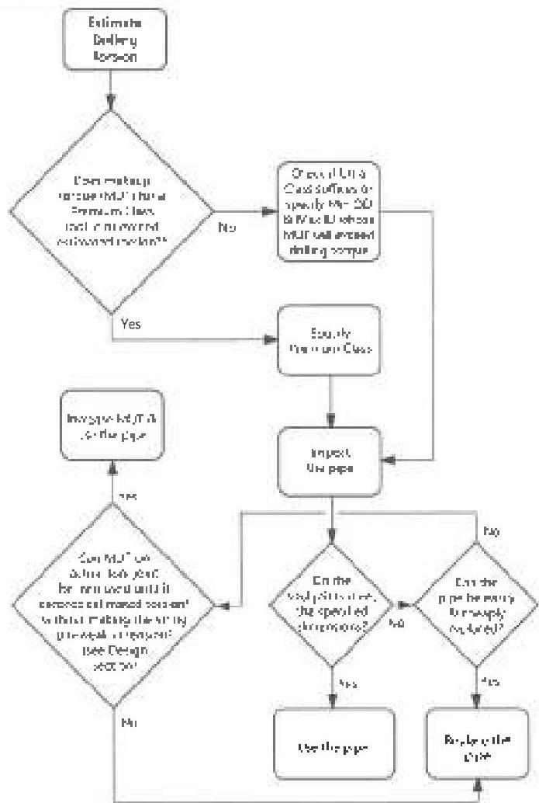

Figure 5.4 A process for vetting and adjusting tool joint diameter requirements. References to Premium Class also apply to Premium Class, Reduced 15K.

Mechanism: Torsion, Combined Tension/Torsion

Inspection: Dimensional 1, Dimensional 2

Verify: Big makeup torque indicator, rig operating torque indicator. While drilling, monitor tool joint wear and confirm the accuracy of the drilling torque prediction and assumptions.

# 5.7.11 Box Shoulder Width

Type: C

Basis: This dimension is established to force a minimum sized box shoulder (not seal) for rotary shouldered connections.

Required: Varies with size, weight, and grade.

Reference: DS-1: Table 3.7.1-3.7.17 and 3.7.25-3.7.29, as applicable.
RP7G-2: Table D.6.
(DS-1 and RP7G-2 are identical.)

Effects: Insufficient shoulder width could cause local yielding on the thin section of a box shoulder at makeup.

Adjustment: None recommended.

Comments: Under eccentric wear, it's possible for a tool joint box to meet the minimum OD requirements of this standard, yet have a very thin box shoulder that is incapable of carrying full makeup torque at the thin point. The minimum box shoulder width limit is intended to prevent this condition. Shoulder width is often confused with seal width on a rotary shouldered connection. Box shoulder width is the distance from the counterbore to the outside diameter of the box, neglecting bevel. Seal width (of the box) is the distance from the counterbore to the inside diameter of the bevel.

Mechanism: Torsion

Inspection: Dimensional 1, Dimensional 2 Inspection

# 5.7.12 Minimum Tong Space

Type: B

Basis: Tool joints must be long enough to be gripped by tongs.

Required: Pins. 75% of minimum tool joint OD with a minimum of 4 inches
Boxes: Box length (Lm) plus 1 inch minimum.

Reference: DS-1: Table 3.7.1-3.7.17 and 3.7.25-3.7.29, as applicable.
RP7G-2: Paragraph 10.20.6. (DS-1 and RP7G-2 are identical except that DS-1 excludes the bevel from the tong space measurement whereas RP7G-2 includes the bevel in the measurement of tong space.)

Effects: Inadequate tong gripping space can result in damage to tool joint seal surfaces.

Adjustment: None recommended.

Mechanism: Connection leak

Inspection: Visual Connection