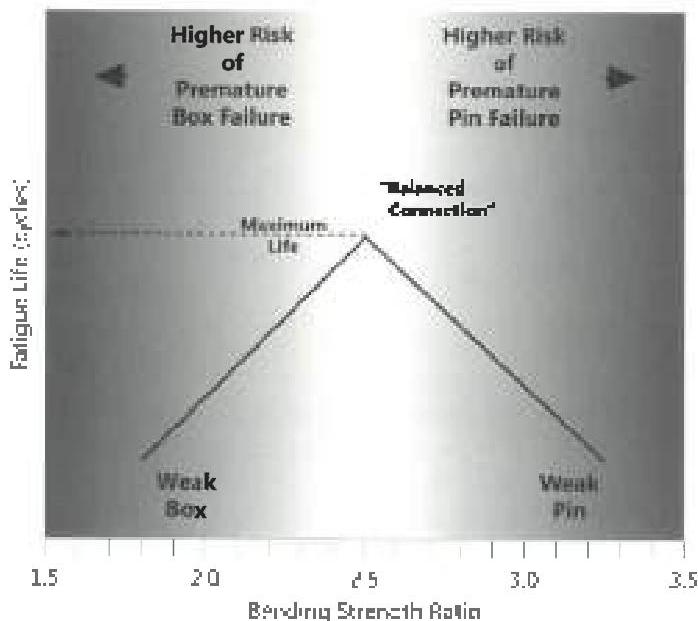

Adjustment: None recommended.

Mechanism: Connection leak, Split box

Inspection: Dimensional 2, Dimensional 3

## 5.8 Acceptance Criteria for Rotary Shouldered Connections on BHA Components

(Note: The above comments applying to tool joint connection damage also apply to BHA connection damage for the following conditions: Seal surface condition, Refusing limits, Bevel width, Thread surface condition, Thread profile/pin load, Box swell, Hardfacing, Counterbore depth, Counterbore diameter, Bevel diameter, Pin neck length, and Cracks. The rationale and comments below apply only to connections on BHA components.)

## 5.8.1 Outside Diameter, Inside Diameter, BSR

Type: B,C

Basis: Connection OD and ID are measured on BHA components to determine connection Bending Strength Ratio (BSR).

Required: The allowed values are determined by the connection type and specified BSR ranges.

Reference: DS-1: Table 3.16.
RP7G-2: Paragraph 10.26.6.1.
RP7G-2 and DS-1 OD and ID requirements are identical for a given connection and BSR.

Effects: A high BSR increases the probability of pin fatigue failure, and vice versa for box failures. A balanced BSR optimizes connection fatigue life.

Adjustment: Bending Strength Ratio is a concept that applies only to the fatigue mechanism in BHA components. In theory, a "balanced" connection has the maximum fatigue life because it distributes fatigue damage equally between box and pin so that one component or the other doesn't fail prematurely (see Figure 5.5). BSR has no meaning when applied to tool joints on normal weight drill pipe, nor does it relate to other performance properties of BHA connections. The historical BSR target of 2.5 has led the industry to specify a "standard" range of around 2.25-2.75 as acceptable for BHA components. This range was adjusted into the current three size categories based on empirical trends. However, the target is experiential rather than based upon calculation or a large amount of empirical data. Therefore, it should not be considered inviolable. The availability of equipment, the need for clearance or failure history can help decide the target BSR. The best approach is probably to use the standard range unless experience suggests otherwise. Then, if problems occur, the BSR can be adjusted as shown in Figure 5.6.

Comments: If it becomes necessary to change BSR, this may be done in one of two ways: By adding material to the weaker member or taking material away from the stronger member. The first alternative is preferable from the failure prevention standpoint. It is not always economical however, as it requires a complete change out of equipment.

For most standard size BHA's, fatigue is the dominant concern, so torsional strength is rarely a factor in component inspection. For small BHA components where torsional strength is the dominant concern, OD and ID may need to be controlled to ensure torsional strength is above the minimum required.

Figure 5.5 Controlling Bending Strength Ratio (BSR) by controlling drill collar connection OD and ID is an attempt to spread fatigue damage equally between box and pin. The historical target of 2.5 is only an approximation. Local experience and equipment availability also play large parts.