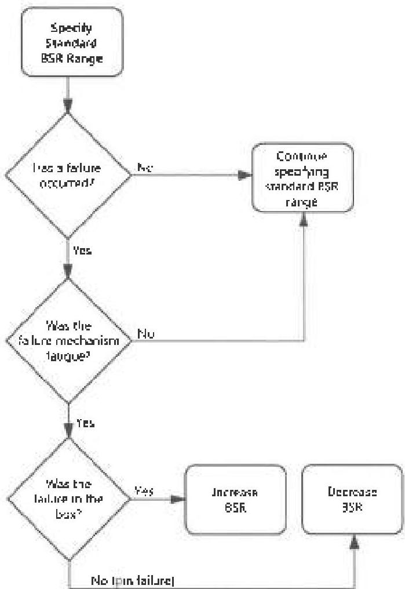

Figure 5.6 The general process for adjusting BSR.

Mechanism: Fatigue

Inspection: Dimensional 3

## 5.8.2 Cracks

Type: A

Basis: The presence of cracks in a BHA connection or slip groove is considered presumptive evidence that the component is damaged beyond repair. Note: A BHA connection crack is cause for rejection if detected in any Service Category. However, in Categories 1 and 2, cracks must be located visually. In Categories 3-5, Blacklight Connection Inspection, Ultrasonic Connection Inspection, or Liquid Penetrant Connection Inspection (whichever applies) are used to detect cracks.

Required: None allowed.

Reference: DS-1: Various inspection procedures. RP7G-2: Various inspection procedures

Effects: The crack may continue to grow until failure occurs.

Adjustment: None recommended.

Comments: Almost all cracks in BHA connections will be fatigue cracks. Up to 90 percent or more of the component's life may be expended by the time a crack has formed and grown large enough to detect by inspection. Given the usual cost of drill string failures, there is little justification to run components with any kind of cracks.

Mechanism: Fatigue

Inspection: Visual Connection, Blacklight Connection, UT Connection, Liquid Penetrant Connection Inspection

## 5.8.3 Dimensions of Stress Relief Features

Type: C

Basis: Stress relief features extend a connection's fatigue life by lowering stress at the critical sections of the connection.

Allowed: Dimensions vary with the connection.

Reference: DS-1: The allowed values are given in Table 3.9 for drill collars and Table 3.10.1 for HWDP. RP7G-2: Table D.10

Effects: The absence of properly dimensioned stress relief features can shorten a connection's fatigue life

Adjustment: Stress relief features reduce the effects of cyclic stresses, which in BHA's come primarily from rotating components while they're bent or buckled, and from vibration. Therefore, loosening this criterion is not recommended if the BHA component will be operated under any of these conditions. However, dimensional requirements for stress relief features could be relaxed without serious concern if the component were to be operated under conditions where all of the following are met: 1) The hole is straight, neither building or dropping angle or inclination. 2) Hole angle is higher than 15