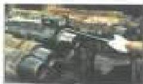

# Glossary

## A

**Acceptable Component:** A drill stem component that meets or exceeds the acceptance criteria of this standard after undergoing the specified inspection program

**Acceptance Criteria:** The dimensions, conditions, and properties that a drill stem component must meet or exceed to be considered acceptable.

**API:** American Petroleum Institute.

**Arbitrary Acceptance Criteria:** A set of acceptance criteria that was not established to meet a specific set of drilling conditions. (Example: “Premium Class”).

**ASNT:** American Society for Nondestructive Testing.

**ASQC:** American Society for Quality Control.

**Auditable Statement:** A statement that will result in the same action when performed independently by more than one individual. Examples (auditable statement). “The tube shall not be longer than 33.0 feet.” (Non-auditable statement): “The tube length shall not be excessive.”

**Austentitizing:** Heating steel to the austentizing temperature (about 1670 degrees F) and allowing time for the steel microstructure to transform to Austenite. Normally the first step in heat treating a steel drill stem component.

## B

**Bevel Diameter:** The outer diameter of the contact face (seal surface) of a rotary shouldered connection.

**BHA (bottom hole assembly):** An assembly of heavy drill stem components configured to accomplish certain tasks and placed at the bottom of the drill string. BHA components may concentrate weight on the bit, rotate the bit, measure drilling parameters and hole trajectory, steer the bit, or perform other functions.

**Bit Sale:** The component that connects the bit to the component immediately above. Bit sales usually have box connections on both ends.

**Blacklight Connection Inspection:** A DS-1 inspection method employing a wet-fluorescent magnetic particle process to look for fatigue cracks in connections.

Bred chcpeon

**Boreback Box:** Machining in the box end of BHA connections to remove un-engaged threads and make the connection more limber. These steps increase the fatigue life of the box.

**Box End:** The half of a threaded connection having internal (female) threads.

**BSR (Bending Strength Ratio):** On bottomhole assembly connections, the ratio of the box section modulus to the pin section modulus. BSR applies only to connections on drill collars and other stiff-bodied components that are run in the BHA. It does not apply to HWDP connections, except the one immediately above the drill collars, or to the connections of any components that are not normally run in the BHA.

## C

**Calibration:** Correcting a measuring device by comparing its output with a standard of known dimensions (acceptable to the NIST (National Institute of Standards and Technology) or an equivalent body.

**Category:** One of six different inspection levels which roughly parallel the severity of drilling service. The inspection category is set by the purchaser of inspection services and establishes the inspection program to be applied to the drill string.

**Class:** See Drill Pipe Class.

**Class 2:** A set of acceptance criteria for used drill pipe taken from API RP7G-2. Class 2 pipe may have more wear and damage than Premium Class pipe.

**Cold-Rolling:** Imparting residual compressive strain to a BHA connection to improve its fatigue resistance.

**Cold Working:** Imparting plastic strain to a component by stressing it beyond its elastic limit. Cold working hardens steel and may render it less resistant to certain failure mechanisms like sulfide stress cracking.

**Crack:** A line on the surface of the material along which it has partial separation, with or without a perceptible opening.

**Crossover Sub:** A short component with different threads on either end used to convert sections of the drill stem from one threaded connection to another.

**Curvature Index (CI):** A measure of the relative fatigue life of a drill pipe tube that is rotating in a curved hole section, taking into account hole curvature, pipe diameter, grade, class and weight, and axial tension in the pipe.

## D

**Dedendum:** The distance between the pitch line and root of a thread.

**Dimensional 1:** A DS-1 inspection method applied to connections on a normal weight drill pipe. Dimensional 1 consists of measurement of go-no-go gaging of box OD, pin ID, shoulder width, and ring space.