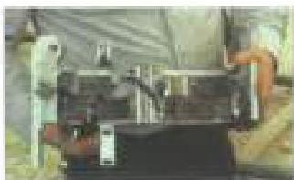

Dimensional 2: A DS-1 inspection method (more rigorous than Dimensional 1) applied to connections on normal weight drill pipe. In addition to the measurements made in Dimensional 1, measurement or go-no-go gaging of counterbore depth, box counterbore, pin flat length, and bevel diameter are measured in Dimensional 2.

Dimensional 3: A DS-1 inspection method applied to connections on heavy weight drill pipe and other BHA components. Dimensional 3 consists of measuring box OD, pin ID, pin lead, bevel diameter, pin stress relief diameter and width, box counterbore diameter, pin thread length, and HWDP center upset diameter.

Drill Collar: Thick-walled pipe used to provide stiffness and to concentrate weight at the bit.

Drill Pipe: A length of pipe, usually steel, to which threaded connections called tool joints are attached.

Drill Pipe Class: A system established by API for ranking the extent of wear and deterioration of drill pipe tubes and tool joints. The specified drill pipe class determines the acceptance criteria to be used by the inspector, and some of the loads that can be safely applied to the component. Drill pipe classes recognized in this standard are, in declining order of load capacity:

- Class 1 (New)
- Ultra Class (Not recognized by API)
- Premium Class
- Premium Class, Reduced TSR (Not recognized by API)
- Class 2

Drill Stem: All the components that are connected together and form the assembly used to drill the well, usually considered from the bottom of the top drive or swivel downward. Also called "Drill String," although the latter term is often used to refer to that part consisting only of normal weight drill pipe.

## E

Electromagnetic Inspection: A DS-1 inspection method involving full-length scanning (between upsets) of normal weight drill pipe tubes using a longitudinal field buggy unit. Only transverse flaws are detected by EMI Inspection. Optional wall thickness monitoring can also be incorporated.

Evil buggy unit

Elevator Groove: A groove cut into drill collars in which elevators can be latched. In Fifth Edition, following the recommendations of the API committees of interest, lifting drill collars with elevator grooves is discouraged. As such, there is no longer a dimensional inspection associated with drill collar elevator grooves as there has been in previous editions.

Extended Reach (ER): A term applied to certain wells characterized by large horizontal displacement to TVD ratios. For design considerations in this standard, ER wells are those wells in which traditional BHA's are removed from the drill stem and his weight is applied by operating normal weight drill pipe in compression.

## F

Failure: Improper performance of a component that prevents completion of its intended function.

Failure Driver: A condition or situation which accelerates a failure mechanism and leads to more rapid failure. Example: Drilling mud corrosiveness is a failure driver for fatigue. More corrosive mud systems cause a drill string component to fail quicker by fatigue, other things equal.

Failure Mechanism: A name given to a chain of conditions and events by which failure can occur (example: Fatigue).

Fatigue: The progressive localized permanent structural damage that occurs when a material undergoes repeated, fluctuating stress cycles. As fatigue damage accumulates at a point, a fatigue crack or cracks can form. Under continued stress cycles, these cracks can grow until failure occurs. In drill stem components, stress cycles occur when the component is bent or buckled, then rotated. They also result from vibration.

Fatigue Crack: A crack resulting from fatigue.

Fitness for Purpose: The principle of tightening or loosening the arbitrary acceptance criteria in this standard when such action is appropriate for either reducing risk or safely reducing cost.

Forging: (see) Plastically deforming metal into desired shapes with compressive force. (see) A shaped metal part formed by the forging method.

Full Length Ultrasonic Inspection (WT/TL/Obj): A DS-1 inspection method involving full length inspection of drill pipe tube bodies using ultrasonic scans. The customer can choose which types of scans are used: Wall Thickness (WT) uses compressional wave scans for minimum wall thickness measurements; Transverse &amp; Longitudinal (TL) uses transverse and longitudinal shear waves to detect flaws in those directions; and Oblique (Obj) uses oblique angled shear waves to detect flaws in those directions.

## G

Galling: The unplanned transfer of metal from one surface to another as the two surfaces slide over one another while being pressed together. Gallung is sometimes a problem in rotary shouldered connections. An excellent anti-galling treatment is to apply a phosphate coating on one or both surfaces.