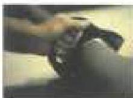

# H

Heat Checks: Shallow cracks on the exterior of tool joints. The cracks are usually formed while the pipe is rotated with high side loads. Typically longitudinal and not detrimental in themselves. Heat checks can lead to failures such as split box.

Heavy Duty Landing String (HDLS): See paragraph 2.5.6.

Heavy Weight Drill Pipe (HWDP): A group of pipes that are between normal drill pipe and drill collars in weight. They are characterized by the absence of an internal upset and the presence of an external upset about midway in the tube.

# I

Information: Data supplied in this standard as a convenience to users. No requirement or recommendation is implied or intended.

Inspection: Under DS-1, examining a used drill stem component to make sure that it has not been worn or damaged beyond the limit allowed by the specified set of acceptance criteria.

Inspection Method: One of several inspection processes outlined in this standard. A single method usually serves to evaluate only one or, at most, a few conditions.

Inspection Procedure: Step-by-step requirements and process quality controls for the conduct of an inspection method.

Inspection Program: A group of one or more inspection methods that are applied to evaluate the acceptability of drill stem components, and the criteria against which the acceptability of the components will be judged.

Integral Pup Joint: A pup joint manufactured from a solid bar and typically heat treated to drill collar or tool joint specifications.

ISO: International Organization for Standardization

# J

Joint: 1) A length of pipe. 2) A connector.

# K

Kelly: The square or hexagonal shaped steel pipe connecting the swivel to the drill pipe. The Kelly is driven by the rotary table to transmit torque to the drill string.

# L

Last Engaged Thread: The last thread on the pin engaged with the box or on the line engaged with the pin.

Liquid Penetrant Connection Inspection: A DS-1 inspection method employing liquid penetrant to look for fatigue cracks in connections of nonmagnetic components.

# M

Makeup: To screw a connection together.

MPI Slip/Upset Inspection: A DS-1 inspection method employing Magnetic Particle Inspection (MPI) applied to slip and upset areas on normal weight drill pipe and HWDP.

# N

NIST: National Institute of Standards and Technology.

Non Auditable Statement: See "Auditable Statement."

Normal Weight Drill Pipe (NWDP): Any size or weight of drill pipe that is listed on Table 3.18.1 of this Standard.

Normalized and Tempered: A term to describe material that has been heat treated by first normalizing, then tempering.

Normalizing: Hardening a ferrous alloy by heating it to the auto-culturing temperature then allowing it to cool slowly.

# O

OD Gage Tube Inspection: A DS-1 inspection method for measuring the outside diameter of normal weight drill pipe to detect diameter variations that fall outside acceptable limits.

Tube OD gage

Oil Country Tubular Goods (OCTG): A term used to refer to the broad group of pipes that are run downhole. Used to differentiate casing and tubing from surface pipe like line pipe. However, the term is not used to refer to some downhole pipes, like heavy weight drill pipe and drill collars.

# P

Pin End: The half of a threaded connection having external (male) threads.

Pony Collar: A short drill collar, often about 1/3 to 1/2 the length of a full drill collar.

Premium Class: A set of acceptance criteria for normal weight drill pipe taken from API RP7G-2, Recommended Practice for Inspection and Classification of Used Drill Stem Elements. DS-1 requires the same attributes for a "Premium Class" drill pipe tube as does API RP7G-2, but addresses more of the attributes of the rotary-shouldered connection on that tube than does API RP7G-2.

Premium Class, Reduced TSR: A class of used drill pipe that meets the requirements of premium class in every detail except tool joint diameters. Tool joint diameters are allowed to be smaller to recognize and control an industry-wide practice of using certain tube/tool joint combinations that give better fishing

371