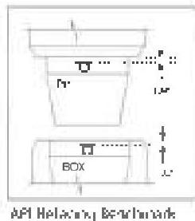

clearances than Premium Class. Premium Class, Reduced T&amp;R is not recognized in API standards.

Pup Joint: A short joint of drill pipe typically used at the top of the string when spacing out or to facilitate handling of short tools.

Q Quenched and Tempered (Q&amp;T): A term to describe material that has been heat treated by first quenching, then tempering. The preferred method for heat treating most ferrous drill stem components.

Quenching: Hardening a ferrous alloy by beating it to the austenitizing temperature, then cooling it rapidly enough to transform all or much of the austenite to martensite.

Range: A length classification for API Oil Country Tubular Goods.

Recommended Action: An action that is recommended by this standard based on assumed conditions which will not apply in every case. Recommended actions are offered solely as a convenience to users of this standard. Users must always consider local conditions before applying any recommendations of this standard, then modify the action if sound engineering judgment dictates.

Refacing: Field repair of seal damage on a rotary shouldered connection by grinding or cutting the seal face. Refacing changes pitch diameter of pin and box, and can lead to seal failure in extreme cases. As a general rule, refacing should be avoided if practical.

Refacing Benchmark: A mark made on the pin neck or box counterbore of a rotary shouldered to indicate the axial position of the original shoulder seal. The benchmark helps quantify the amount of refacing a connection has undergone.

Reference Indication: The indication that a flow detecting inspection device gives when it seams an artificial calibration reference standard with the calibration gain setting.

Rejectable Component: A drill stem component which fails to meet or exceed the acceptance criteria outlined in this standard after undergoing all or part of the specified inspection program.

Required Action: An action that must be accomplished in order to comply with this standard. Responsibility for compliance with any required action of this standard can only be established by one user of this standard upon another by agreement between the two parties.

Rotary Shouldered Connection: A threaded connection used on drill stem components characterized by coarse, tapered threads and makeup shoulders.

S Saver Sub: A sub that screws onto a high-cost drill stem component. Repeated make-breaks are made on the saver sub, protecting the threads on the high-cost component from damage.

Service Category: See Category.

Shoulder: On a rotary shouldered connection, the parts of pin and box that abruptly stop further thread engagement when the connection is made up (screwed together). Also called makeup shoulder. However, for calculating makeup torque and torsional capacity, the shoulder is assumed to be 3/8 of an inch from this location. This removes the influence of the bevel when calculating these values.

Shoulder Width: The distance from the box counterbore or pin neck to the tool joint outside diameter, ignoring the tool joint bevel.

Slip Area: The area on drill pipe, usually near the butt end, where slips are set when running the pipe into or out of the well.

Slip Groove: A groove cut into drill collars, in which slips can be set.

Slip Groove Inspection: A DS-1 inspection method used for measuring the dimensions of drill collar slip grooves and checking for flaws in the grooves.

Split Box Failure: A drill stem failure, made in which a connection has splits longitudinally.

Stabilizer: A BHA component having a body diameter about the same size as a drill collar, and having longitudinal or spiral blades that form a larger diameter, often at or near hole diameter.

Standard Rack Inspection: An obsolete term once used in the inspection industry to refer to a program for inspecting drill pipe. The actual meaning of the term was not defined on any industry-wide basis, and its meaning varied from company to company, and by geographical location. DS-1 Category 3 was the precisely defined inspection program which the sponsor committee used to replace what was once generally practiced as "Standard Rack Inspection."

Standardization: Adjusting the output of an instrument to some arbitrary reference value, a check to ensure that an instrument setting has remained constant.