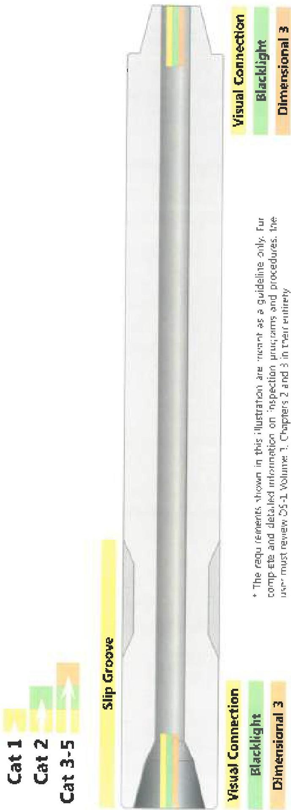

Figure 2.8 Drill Collar Inspection Program*

# Visual Connection

# Blacklight

# Dimensional 3

* The requirements shown in this illustration are meant as a guideline only. For complete and detailed information on inspection programs and procedures, the user must review DS-1 Volume 1, Chapters 2 and 3 in their entirety

Note 1 For nonmagnetic components, use UT Connection or Liquid Penetrant Inspection (LPI) in lieu of Blacklight. UT is recommended for nonmagnetic components. If LPI is used the pin ID shall also be inspected