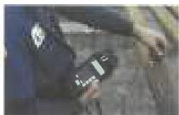

Stiffness Ratio: The ratio of the section modulus (Z) of drill stem components immediately below a change in drill stem diameter, to the section modulus of those immediately above. Stiffness Ratio is calculated using tube diameters, not connection diameters.

Stress Corrosion Cracking (SCC): A failure mechanism that affects some nonmagnetic material. In SCC, rapid anodic corrosion attacks the material along its grain boundaries while the material is under tensile stress.

Stress Relief Groove: A groove machined on a BHA connection pin to reduce stress by removing unused threads that act as stress concentrators. Stress relief grooves may have a nominal effect on the torsional and tensile capacity of the pin neck, but are placed primarily to increase its fatigue life.

Sub: A short drill stem component.

Sulfide Stress Cracking (SSC): A drill stem failure mode in which cracks form in a drill stem component when hydrogen is liberated during a chemical reaction between steel and hydrogen sulfide.

T

TSR: Torsional Strength Ratio. The ratio of tool joint torsional strength divided by tube torsional strength.

Tempering: Reheating a quenched-hardened or normalized ferrous alloy to a temperature below the transformation range and then cooling.

Tensile Capacity: In this standard, the product of the cross-sectional area of a drill string component times the specified minimum yield strength of that component.

Tensile Failure: A failure mode in which the applied tension on a component exceeds the product of its cross-sectional area times the actual yield strength of that component.

Thick-Walled Drill Pipe (TWDP): A class of drill pipe having thicker wall than normal weight drill pipe. Often used for heavy duty landing strings.

Thread Root: In a connection, the area at the base of the thread form. If the threads are considered projections above a surface, the thread root would be the part of the surface between adjacent threads.

Tolerance: The amount of variation permitted from the nominal or stated value.

Tool Joint: A heavy bar with a rotary shouldered connection pin or box on one end. The other end is attached to a joint of drill pipe or heavy weight drill pipe. Tool joints provide a means for connecting drill pipe, and a robust place to attach makeup tongs.

Torsional Capacity: The calculated torsion required to yield a drill string component, assuming minimum specified yield strength and either actual or assumed minimum dimensions.

Torsional Failure: A failure mode in which a part of the drill stem is plastically deformed beyond specified acceptance limits due to the application of torsion loading.

Traceability: A DS-1 inspection method for critical service drilling and landing equipment to ensure that each tool is uniquely identified and manufactured from material that is in accordance with previously defined material specifications.

U

Ultra Class: An inspection acceptance criterion of used drill pipe that is more stringent than Premium Class. Ultra Class was mainly developed for deepwater applications.

Un-Inspectable Component: A drill stem component which can be determined to be neither acceptable nor rejectable due to some condition which renders the inspection process unreliable. Example: A drill pipe tube that is pitted to the extent that the EMI inspection log background noise exceeds the limits of this standard.

UT Connection Inspection: A DS-1 inspection method employing normal-beam ultrasonic testing to look for fatigue cracks in connections.

UT Slip/Upset Inspection: A DS-1 inspection method employing shear-wave ultrasonic testing to look for fatigue cracks in slip and upset areas of drill pipe.

UT Wall Thickness Inspection: A DS-1 inspection method employing normal-beam ultrasonic testing to measure the wall thickness of drill pipe tubes.

UT Thickness range

V

Visual Connection Inspection: A DS-1 inspection method for visually examining rotary shouldered connections.

Visual Tube Inspection: A DS-1 inspection method for visually examining the tubes of normal weight drill pipe.

W

Welded Pup Joint: A pup joint manufactured similar to normal weight drill pipe where tool joints are welded to an upset tube

373