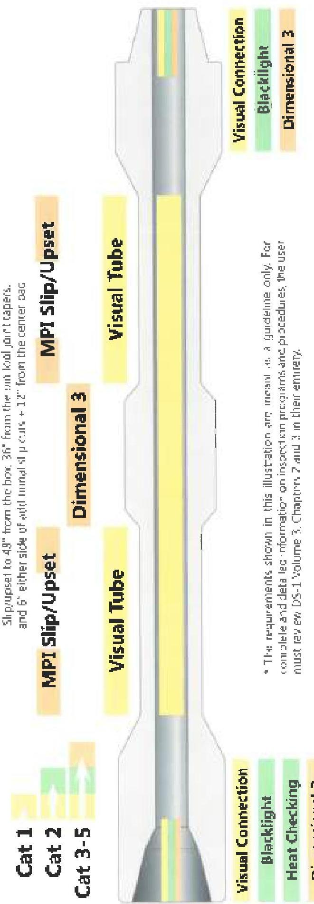

Figure 29 HWDP Inspection Program*

* The requirements shown in this illustration are meant as a guideline only. For complete and detailed information on inspection programs and procedures, the user must review DS-1 Volume 3, Chapters 2 and 3 in their entirety.

Note 1: For nonmagnetic components, use LT Connection or Liquid Penetrant Inspection (LPI) in lieu of Blacklight. LT is recommended for nonmagnetic components. If LPI is used the pin ID shall also be inspected.

Note 2: For ferromagnetic components, Wet Visible Contrast Inspection may be substituted for MPI Slip/Upset Area Inspection.