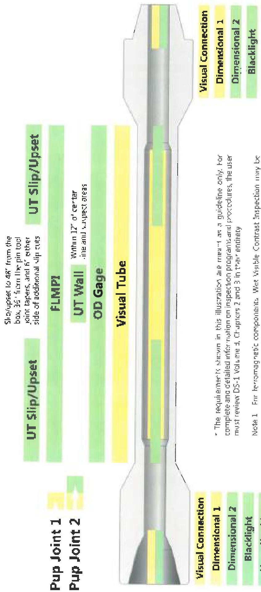

Figure 2.10 Welded Pup Joint Inspection Program*

* The requirements shown in this illustration are meant as a guideline only, for complete and detailed information on inspection programs and procedures, the user must review DS-1 Volume 3, Chapters 2 and 3 in their entirety

Note 1: For ferromagnetic components, Wet Visible Contrast Inspection may be used in lieu of FLMP. For nonmagnetic components, use Liquid Penetrant Inspection (LPI) in lieu of FLMP.

Note 2: For nonmagnetic components, use UT Connection or Liquid Penetrant Inspection (LPI) in lieu of Blacklight. PLPI is used, the pin ID shall also be inspected.

29