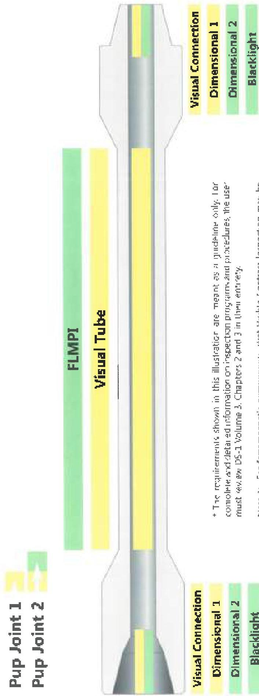

Figure 2.11 Integral Pup Joint Inspection Program

* The requirements shown in this illustration are meant as a guideline only. For complete and detailed information on inspection programs and procedures, the user must review DS-1 Volume 3, Chapters 2 and 3 in their entirety.

Note 1: For ferromagnetic components, Wet Visible Contrast Inspection may be used in lieu of FLMPI. For nonmagnetic components, use Liquid Penetrant Inspection (LPI) in lieu of FLMPI.

Note 2: For nonmagnetic components, use LT Connection or Liquid Penetrant Inspection (LPI) in lieu of Blacklight. FLMPI is used, the pin ID shall also be inspected.