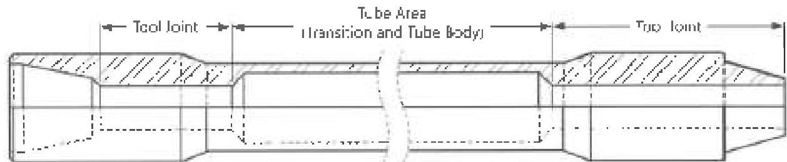
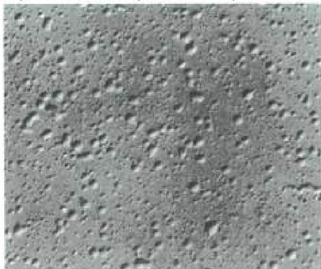
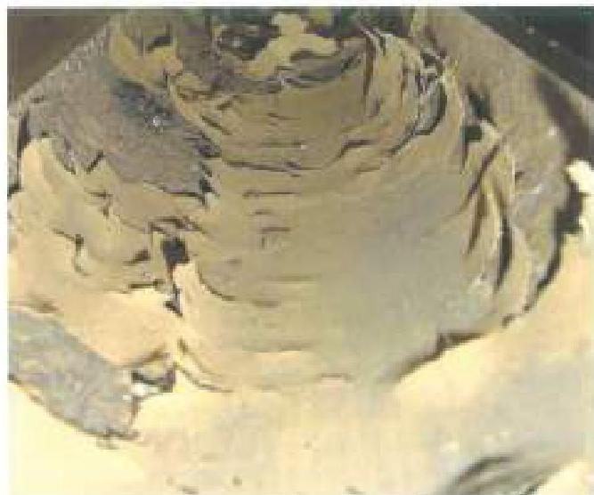
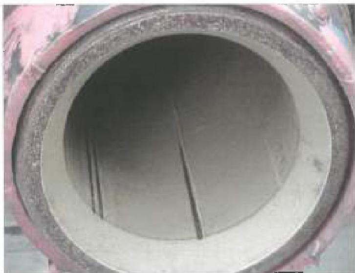
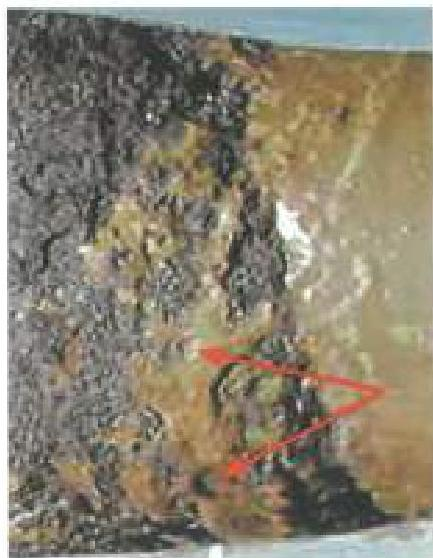

Figure 3.4.1 Drill Pipe Areas with Internal Plastic Coating (IPC)

A: photos below courtesy of NOV Tuboscope
Figure 3.4.2 Bittered Coating

Figure 3.4.3 Coating Delaminating (Feeling) away from an area of damage.

Figure 3.4.4 Wireline Cuts in coating

Figure 3.4.5 Underfilm Corrosion where the coating film appears to be pushed up and corrosion is taking place under intact coating.