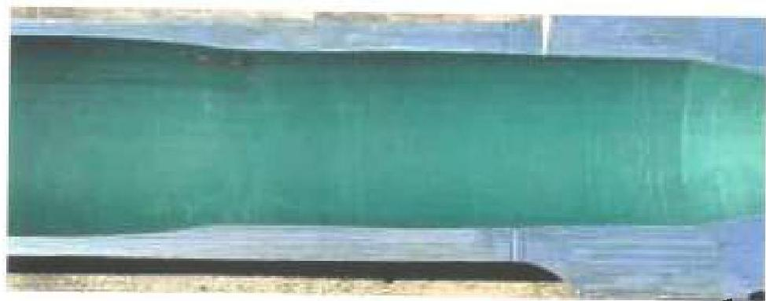
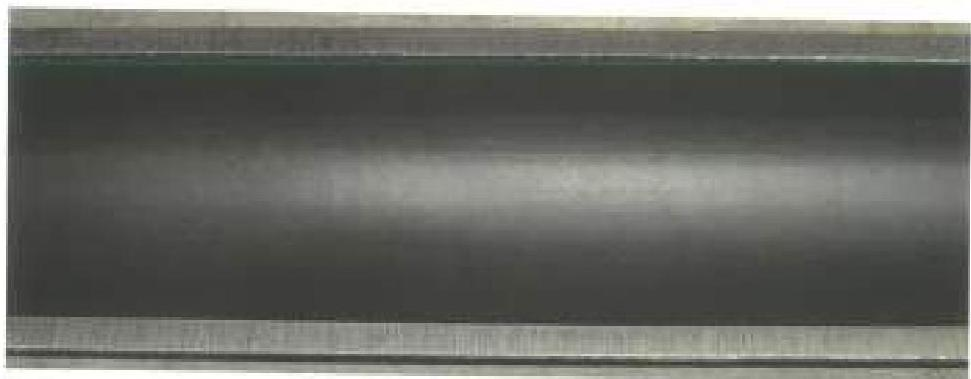
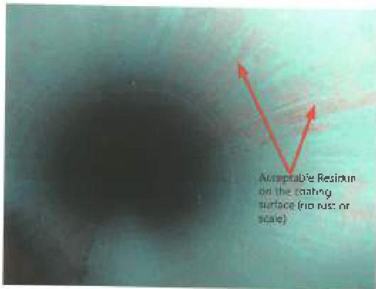
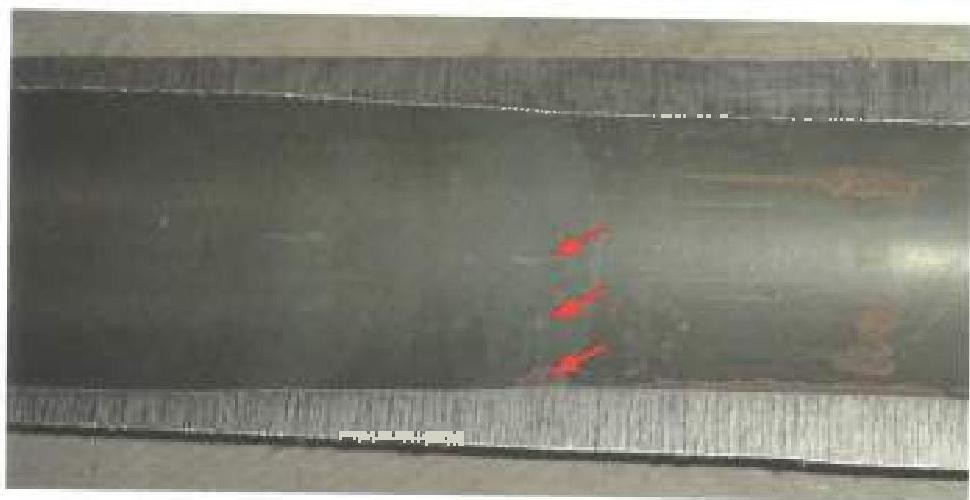

Figure 3.4.6
ID Coating Reference Condition 1 in the Upset Run-out. No visible damage.

Figure 3.4.7
ID Coating Reference Condition 1 Tube Body. No visible damage.

Figure 3.4.8
ID Coating Reference Condition 1 Tube Body. Internal camera view shows no visible coating damage down to steel substrate and no corrosion products.

Figure 3.4.9
ID Coating Reference Condition 2 Internal Upset Run-out. Note the damage in the tool joint continuing or extending into the upset run-out. Surface corrosion without significant metal loss. Localized coating loss is less than 25% and overall coating loss is less than 20%.

37