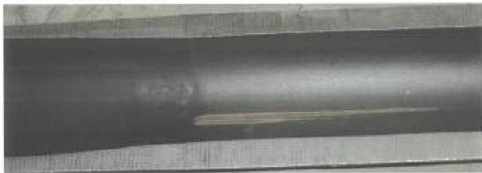
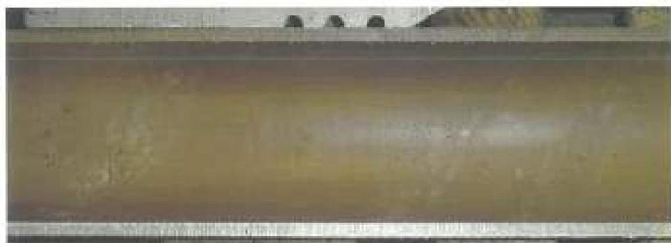
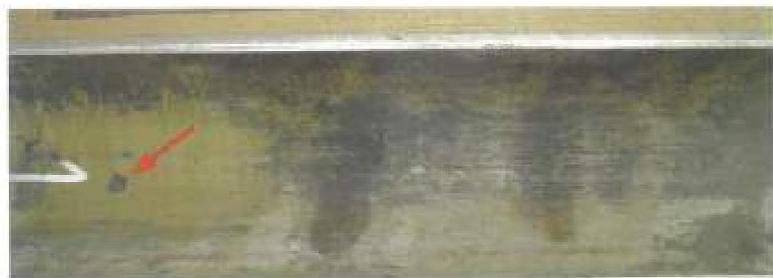
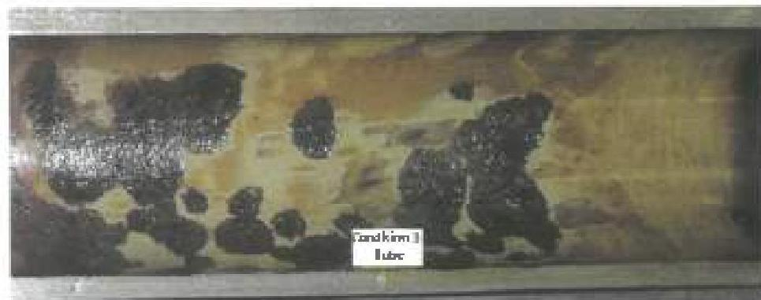
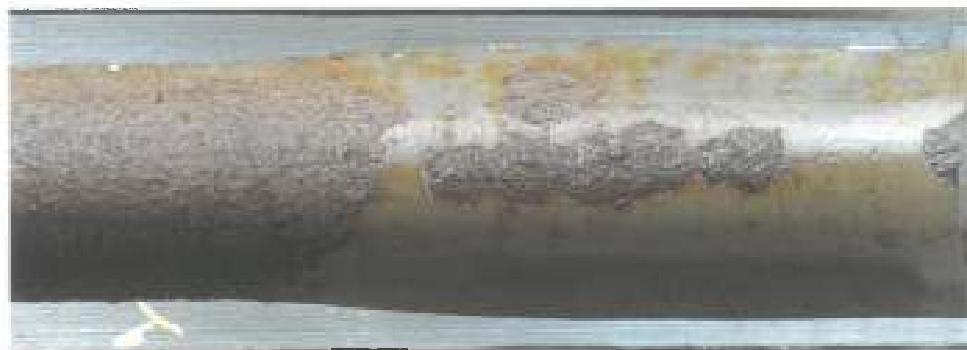

Figure 3.4.10
ID Coating Reference Condition 2 Internal Upset Run-out. Note mechanical damage (wireline cut) extends into the upset run-out from the tool joint. Localized coating loss is less than 25% and overall coating loss is less than 20%.

Figure 3.4.11
ID Coating Reference Condition 2 Tube Body. Note probable areas of coating damage and minor indication of rust on the left.

Figure 3.4.12
ID Coating Reference Condition 2 Tube Body. Note isolated area of coating damage down to the metal substrate. Overall coating loss is less than 20%.

Figure 3.4.13
ID Coating Reference Condition 3 Tube Body. Note several areas of coating loss down to bare steel, there is no peeling of the coating in those areas. Localized coating loss is more than 25% but less than 50%. Overall coating loss is less than 35%.

Figure 3.4.14
ID Coating Reference Condition 3 Tube Body. Localized coating loss in tube area is more than 25% but less than 50%. Overall coating loss is less than 35%. Presence of surface corrosion but no signs of blistering or deamination. Coating loss in tool joint area is not to be included.

38