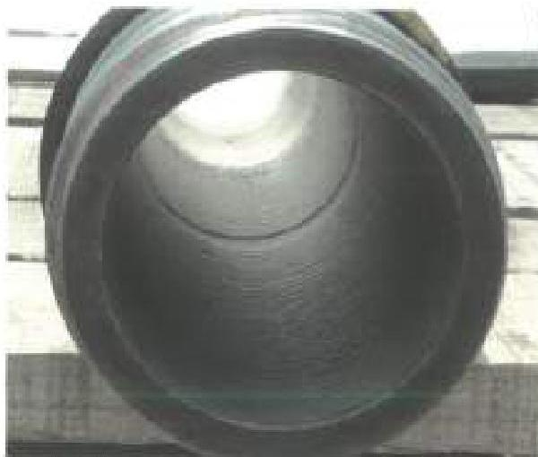
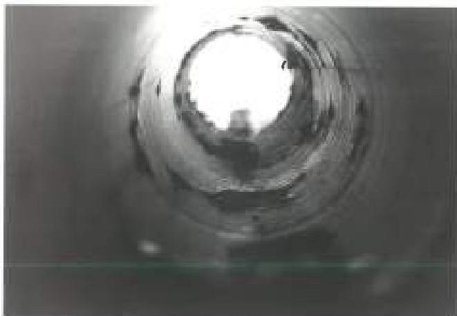
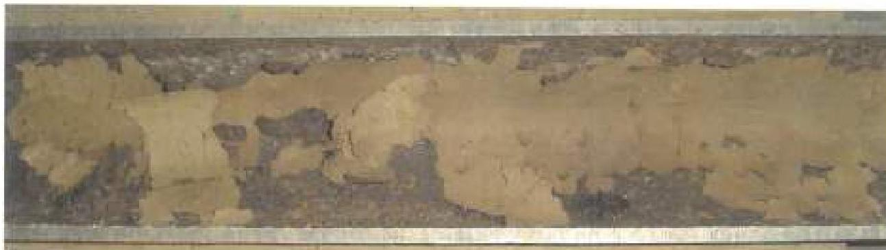

Figure 3.4.15 ID Coating Reference Condition 4. The presence of blisters indicates coating degradation which can be caused by excessive temperature, chemical exposure, and/or the coating reaching the end of its useful life.

Figure 3.4.16 ID Coating Reference Condition 4 Tube Body. Delamination of the coating in the tube body.

Figure 3.4.17 ID Coating Reference Condition 4 Tube Body. Note the loss of coating and presence of delamination.

f. Sample description of coating damage and defects such as wireline cuts, blistering, delamination, and underfilm corrosion are provided in Figures 3.4.2 through 3.4.5.

g. Sample pictures of drill pipe tube body and upset run-out illustrating ID Coating Reference Conditions 1, 2, 3, and 4 are provided in Figures 3.4.6 through 3.4.17.

h. Optional tool joint criteria: If specified by the customer, the ID surface of internally coated drill pipe shall be examined for signs of deterioration of the internal plastic coating in the tool joint area (see Figure 3.4.1). Blistered coating, delamination/peeling, or underfilm corrosion of the coating in the tool joint area shall be a cause for rejection of the drill pipe unless waived by the customer. If approved by the customer, the damaged coating may be removed entirely from the tool joint area.

## 3.5 OD Gage Tube Inspection

### 3.5.1 Scope

This procedure covers the full length mechanical gaging of the drill pipe or workstring tube for outside diameter variations.

### 3.5.2 Inspection Apparatus

a. Direct reading or go-on-go type gages may be used to locate areas of OD reduction. Gages must be capable of identifying the smallest permissible tube outside diameters.

b. Any electronic, dial, or Vernier device used to set or calibrate the OD gage shall itself have been calibrated. See section 2.21 for calibration requirements.

c. Fixed setting standards for field use shall be verified to ±0.002 inch accuracy using one of the devices above.

39